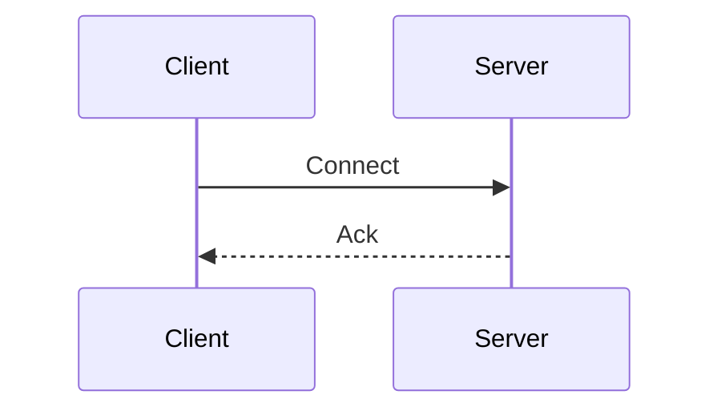

# Repo Context — Learning Hub

Extended reference for the `add-learning-note` skill.

---

## Existing Notes Catalog

| Category | File | Title |
|---|---|---|
| `databases` | `postgresql-notes.md` | PostgreSQL Architecture & Internals |
| `networking` | `socket.md` | WebSockets & Socket.IO |
| `networking` | `progressive-web-apps.md` | Progressive Web Apps (PWAs) |
| `mobile` | `push-notifications-notes.md` | Push Notifications, FCM & APNs |
| `mobile` | `flutter-webview.md` | Flutter WebView Integration |
| `tooling` | `vitepress-notes.md` | VitePress SSG & Customization |

**Current note count**: 6

---

## Category Emoji Map (`.vitepress/config.mts`)

```ts
const categoryEmojis: Record<string, string> = {
  databases: '🗄️',
  networking: '⚡',
  mobile: '📲',
  tooling: '🛠️'
}
```

When a new category is created, add an entry here. The key is the folder name (lowercase). Pick an appropriate emoji.

---

## `notes/index.md` — Card Format

The notes hub page uses custom HTML with VitePress classes. Each note is a card inside a `.hub-grid` div, grouped under a `.hub-section-title`.

### Card Template

```html
<a href="/notes/<category>/<filename-no-extension>" class="hub-card">
  <div>
    <div class="hub-card-header">
      <span class="hub-card-icon">EMOJI</span>
      <span class="hub-badge badge-CATEGORY">BADGE LABEL</span>
    </div>
    <div class="hub-card-title">NOTE TITLE</div>
    <div class="hub-card-desc">
      2-3 sentence description of what the note covers.
    </div>
  </div>
  <div class="hub-card-footer">
    <span>Read Full Note</span>
    <span>→</span>
  </div>
</a>
```

### Badge Classes by Category

| Category | Badge Class | Label |
|---|---|---|
| databases | `badge-db` | Database |
| networking | `badge-network` | Networking |
| mobile | `badge-mobile` | Mobile & OS |
| tooling | `badge-tooling` | Developer Tools |

For a **new category**, pick a descriptive label and use a new badge class (the CSS for existing badges is in `.vitepress/theme/`). If unsure, reuse the closest existing badge class.

### Section Title Template

```html
<div class="hub-section-title">EMOJI SECTION NAME</div>

<div class="hub-grid">
  <!-- cards go here -->
</div>
```

---

## `notes/index.md` — Stat Count

Line to update (currently):
```html
<div class="hub-stat-item">📚 <span>6 Comprehensive Notes</span></div>
```

Increment the number by 1 each time a new note is added.

---

## Root `index.md` — Feature Card Format (New Categories Only)

The root `index.md` uses VitePress `layout: home` with a `features:` list. Only update this when a **new category** is introduced.

```yaml
features:
  - icon: EMOJI
    title: CATEGORY TITLE
    details: 1-2 sentence description of what this category covers.
    link: /notes/<category>/<first-note-filename>
```

---

## VitePress Sidebar — How It Works

The sidebar is **100% auto-generated** by the `getSidebar()` function in `.vitepress/config.mts`. It:
1. Reads all subdirectories in `notes/`
2. For each subdirectory, reads all `.md` files (excluding `index.md`)
3. Extracts the `# First Heading` of each file as the sidebar label
4. Builds a grouped sidebar keyed by `/notes/<category>/`

**No manual sidebar config changes are needed** when adding a note to an existing category. Just drop the `.md` file in the right folder and the sidebar updates on next build.

For a **new category**, the sidebar auto-picks it up too — but you still need to add the emoji to `categoryEmojis` so the section title looks right.

---

## Mermaid Diagrams

The site uses `vitepress-plugin-mermaid`. Use standard Mermaid syntax inside fenced code blocks:

````

````

**Gotchas:**
- Quote labels that contain parentheses or brackets: `id["Label (Extra)"]`
- Avoid HTML tags inside node labels — they will break rendering
- Prefer `sequenceDiagram`, `flowchart TD`, and `graph LR` for most use cases

---

## Stale / Unused Directories

- `recap/` — empty, stale. Do not use or create files here.
