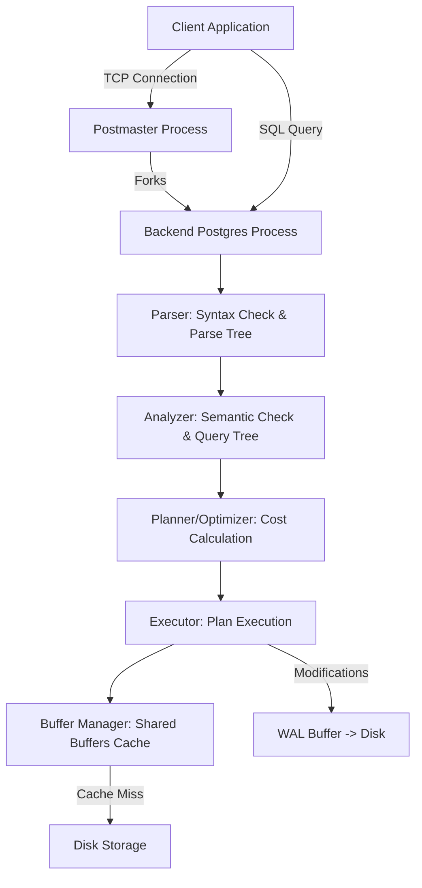

# 📘 PostgreSQL Notes

Comprehensive, interview-ready conceptual guide to PostgreSQL, covering internal architecture, query execution, indexing, concurrency, and production scaling.

---

## 1. The Problem This Technology Solves

Before modern, robust Relational Database Management Systems (RDBMS) like PostgreSQL, systems stored data in flat files, early hierarchical/network databases, or basic relational engines that lacked proper transactional safety, query optimization, and write concurrency.

| Older/Alternative Approach | How it Works | Why it Falls Short |
| :--- | :--- | :--- |
| **Flat Files / Custom Binary Formats** | Data stored in raw text files or custom binaries parsed by application code. | No standard query language; no concurrent write protection (prone to corruption); no relational constraints or schema enforcement; manual implementation of search logic. |
| **Hierarchical / Network Databases (e.g., CODASYL)** | Data organized in trees or graphs where parent/child relationships are hardcoded at the storage level. | Queries are tightly coupled to physical data layouts; changes to schemas require rewriting all query logic; extremely complex to handle ad-hoc queries. |
| **Basic RDBMS (Without ACID or Weak Concurrency Control)** | Early relational databases that did not enforce full transaction isolation or atomicity. | Under concurrent writes, transactions read dirty, uncommitted, or inconsistent data; updates get lost; database state becomes corrupted upon system crashes. |
| **Simple SQL Databases (e.g., SQLite or early MySQL versions)** | Light database engines designed for single-user or read-heavy applications, using coarse table-level locking. | Concurrency bottlenecks under write-heavy workloads (entire tables lock up); lack of advanced indexing (like GIN/GiST) for non-scalar data types like JSON or spatial vectors. |

**Interview one-liner:**
> **"PostgreSQL solves the challenges of data integrity, query complexity, and high-concurrency writes by offering a highly extensible, fully ACID-compliant object-relational database engine."**

---

## 2. Core Definition

At its core, **PostgreSQL** (often called Postgres) is an open-source, enterprise-grade **Object-Relational Database Management System (ORDBMS)**. 

Unlike a pure Relational Database (RDBMS), an Object-Relational Database supports object-oriented concepts directly in the schema—such as user-defined custom data types, functions, operators, and table inheritance—while fully preserving SQL standards and relational mathematical models.

### Commonly Confused Terms

| Term | What It Is | Key Difference |
| :--- | :--- | :--- |
| **SQL** | Structured Query Language; a standardized language specification. | SQL is the **language** used to query data; PostgreSQL is the actual **database engine** that implements and executes that language. |
| **RDBMS vs. ORDBMS** | Relational Database vs. Object-Relational Database. | An RDBMS only supports standard tabular schemas and basic data types. An ORDBMS allows you to define complex objects, custom functions, and inheritance hierarchies inside the database catalog. |
| **PostgreSQL vs. MySQL** | Two major open-source relational databases. | Postgres uses a **multi-process** architecture, implements strict SQL standards compliance, uses MVCC with append-only storage, and handles complex analytical queries excellently. MySQL uses a **multi-threaded** architecture, has historically been more permissive with standards, uses an undo-log for MVCC updates in-place, and is traditionally optimized for simple, high-speed read-heavy CRUD. |

**Interview one-liner:**
> **"PostgreSQL is an enterprise-grade Object-Relational Database Management System (ORDBMS) defined by its strict adherence to SQL standards, complete ACID compliance, and advanced extensibility via custom types and procedural languages."**

---

## 3. How It Actually Works Under the Hood

When an application sends a query to PostgreSQL, the request goes through a multi-stage execution pipeline managed by Postgres's multi-process architecture.



### Step 1: Connection & Process Isolation
Postgres operates on a **process-based architecture** (not threaded). The main supervisor process (`postmaster`) listens on port 5432. 
- When a client connects, `postmaster` accepts the connection and **forks a new dedicated backend process** (`postgres`) for that client.
- This process manages everything for that connection’s session. If a backend process crashes due to a memory error, it is isolated and does not crash the database engine or other clients.

### Step 2: The Parsing and Analyzing Stage
1. **Parser**: Checks the SQL string for syntactic correctness and outputs a *Parse Tree*.
2. **Analyzer/Analyser**: Performs semantic analysis. It queries the system catalogs (metadata tables) to verify if the tables, columns, and functions exist, and checks if the client has permission to access them. It outputs a *Query Tree*.

### Step 3: The Planner & Optimizer (Cost-Based Optimizer)
This is the "brain" of PostgreSQL.
1. The planner generates multiple candidate execution plans (e.g., Sequential Scan vs. Index Scan, Nested Loop Join vs. Hash Join).
2. It calculates the estimated **cost** of each plan using database statistics (collected by the background `ANALYZE` process and stored in `pg_statistic`). Cost units represent estimated disk page fetches and CPU computations.
3. The planner selects the plan with the lowest cost and passes it to the Executor.

### Step 4: The Executor & Buffer Manager
1. The Executor runs the plan, requesting data pages (usually in 8KB blocks) from the **Buffer Manager**.
2. The Buffer Manager checks **Shared Buffers** (the RAM cache allocated for Postgres).
   - **Cache Hit**: Data is returned instantly from RAM.
   - **Cache Miss**: The buffer manager requests the block from disk storage, loads it into Shared Buffers, and returns it.

### Step 5: MVCC & The Append-Only Write Mechanism
When data is updated or deleted, Postgres does not overwrite the row in place:
- **Insert**: A new row version (tuple) is written to a page.
- **Update**: Postgres writes a *new* version of the row with the modified data. It marks the old version as superseded.
- **Delete**: Postgres marks the existing row as deleted, but does not immediately remove it from disk.
- **Visibility**: Every row contains hidden system columns, notably `xmin` (the Transaction ID that created the row) and `xmax` (the Transaction ID that deleted/superseded it). When a query runs, Postgres compares these IDs against the current transaction status to determine which version of the row is visible. This ensures that readers never block writers, and writers never block readers.

### Step 6: Write-Ahead Logging (WAL)
To guarantee durability (the "D" in ACID) without writing whole 8KB data blocks to disk on every transaction (which is slow):
1. Any insert/update/delete operation is first written sequentially to a memory buffer called the **WAL Buffer**.
2. Upon transaction commit, the WAL Buffer is flushed to persistent disk storage sequentially (called a **WAL Flush**). Because sequential disk writes are extremely fast, this guarantees that changes are safe on disk.
3. The actual data pages in Shared Buffers are modified in RAM and written to disk later in the background by the **Background Writer** or during a **Checkpoint**.
4. In a crash, Postgres recovers by starting from the last checkpoint and replaying the WAL logs.

### Step 7: Autovacuum
Because MVCC leaves old, deleted row versions (called **dead tuples**) on disk, the database page files will grow bloated over time. 
- A background daemon called **Autovacuum** runs continuously in the background.
- It scans tables to clean out dead tuples, reclaiming page space for new inserts, and updates table statistics so the Planner can make accurate cost decisions.

**Interview one-liner:**
> **"Under the hood, PostgreSQL uses a multi-process architecture where a master process forks a dedicated backend for each connection, executes queries by choosing the lowest-cost path using cost-based optimization, and manages concurrency using MVCC and Write-Ahead Logging (WAL)."**

---

## 4. Core Properties / Characteristics

PostgreSQL’s behavior and guarantees can be defined by several fundamental characteristics:

| Characteristic | Property | What It Means in Plain English |
| :--- | :--- | :--- |
| **Concurrency Model** | MVCC (Multi-Version Concurrency Control) | Instead of locking tables or rows during updates, Postgres keeps multiple versions of rows. Readers see a snapshot of the database at a specific point in time, allowing concurrent reading and writing. |
| **Process Model** | Multi-Process (Fork-on-Connection) | Each connection gets its own private process memory room. While highly stable, it has high RAM overhead per connection (around 10MB) compared to thread-based engines. |
| **SQL Standards Adherence** | High ANSI SQL Compliance | Postgres strictly conforms to core SQL standards (supporting features like Window Functions, CTEs, Recursive queries, and Arrays out of the box). |
| **Storage Engine Architecture** | Heap-based Storage with WAL | Table rows are stored in unordered heap pages. Index structures point to physical locations (TIDs) in these heaps. Modifying data requires write-ahead logging to guarantee crash recovery. |
| **Transaction Isolation Levels** | Read Committed, Repeatable Read, Serializable | Controls visibility of concurrent changes. Postgres prevents dirty reads at all levels and features true Serializable Snapshot Isolation (SSI) to prevent write skew. |
| **Extensibility** | Programmable & Dynamic | You can write custom code (in SQL, PL/pgSQL, Python, or Javascript) that runs directly inside the database, or load C-based extensions (like PostGIS for maps or TimescaleDB for time-series). |

**Interview one-liner:**
> **"PostgreSQL is characterized by its process-per-connection isolation, strict SQL standards compliance, heap-based storage structure, and MVCC-driven transactional model."**

---

## 5. The Bare/Raw Version vs. The Popular Library/Framework Version

Developers rarely write raw TCP network commands to talk to Postgres. Instead, they use database client drivers (the "raw" version) or Object-Relational Mappers (ORMs) (the "library" version).

| Feature | Raw Client Driver (e.g., `pg` in Node, `psycopg2` in Python) | Modern ORM (e.g., Prisma, TypeORM, SQLAlchemy) |
| :--- | :--- | :--- |
| **What it is** | A low-level wrapper that sends raw SQL query strings over a TCP connection and returns raw database rows as basic arrays/objects. | An abstraction layer that maps database tables to object-oriented code classes or typesafe query interfaces. |
| **Query Style** | Write raw SQL strings: `SELECT * FROM users WHERE age > $1` | Call object methods: `prisma.user.findMany({ where: { age: { gt: 18 } } })` |
| **Type Safety** | Minimal. You must manually define TypeScript interfaces matching your database output. | High. TypeScript types are automatically generated from your database schema definitions. |
| **Database Migrations** | Done manually using raw SQL files (`CREATE TABLE...`) or basic SQL-only migration tools. | Declared in a custom config schema, with migration scripts auto-generated and kept in sync with code. |
| **Performance** | Maximum efficiency. Zero parsing overhead, and you control the exact SQL, joins, and indexing strategies. | Overhead of translating method chains to SQL. Risk of poorly optimized queries, redundant joins, or the N+1 select problem. |
| **Connection Pooling** | Handled explicitly in your code using driver configurations. | Abstracted away, but can be complex to tune in serverless setups (often requiring proxy tools). |

### Important Nuance: The ORM Magic Trap
ORMs do not replace database knowledge. Under the hood, an ORM translates class methods into SQL queries. If you run a loop that fetches an author and then fetches their books one by one, a raw driver forces you to see the bad SQL, whereas an ORM hides it behind simple property lookups, executing $N+1$ network requests and bringing down performance.

**Interview one-liner:**
> **"While raw client drivers give you absolute control over SQL syntax, execution cost, and low-level connection pools, modern ORMs trade raw query performance for type safety, automated schema migrations, and faster developer velocity."**

---

## 6. Core Components — Practical Breakdown

### 1. Indexes (B-Tree vs. GIN)
- **What it is**: Data structures stored separately from table data to speed up search queries.
- **Code Example**:
  ```sql
  -- B-Tree Index (Default, best for equality and range queries)
  CREATE INDEX idx_users_email ON users(email);

  -- GIN (Generalized Inverted Index, best for JSONB or array searches)
  CREATE INDEX idx_users_metadata ON users USING gin(metadata);
  ```
- **When to use it**: Use B-Tree for columns frequently used in `WHERE`, `JOIN`, or `ORDER BY` clauses (like IDs, emails, timestamps). Use GIN when searching inside composite structures like JSONB columns or arrays.

> 💡 **B-Tree vs. GIN — Common Interview Mix-up**
> A **B-Tree** index maps a column value directly to a row. It is highly optimized for sorted scalar comparisons (`=`, `<`, `>`). A **GIN** index is an *inverted* index; it splits complex values (like keys/values in a JSON document or elements in an array) into individual parts and maps each sub-element back to the rows containing it.

---

### 2. Transactions and Isolation Levels
- **What it is**: An atomic unit of work containing multiple SQL statements that must either all succeed or all fail together.
- **Code Example**:
  ```sql
  BEGIN;
  UPDATE accounts SET balance = balance - 100 WHERE id = 1;
  UPDATE accounts SET balance = balance + 100 WHERE id = 2;
  COMMIT;
  ```
- **When to use it**: Essential for operations requiring strict logical consistency, such as financial transfers, checkout pipelines, or inventory updates.

> 💡 **Read Committed vs. Repeatable Read vs. Serializable — Common Interview Mix-up**
> - **Read Committed** (Postgres default): A statement inside a transaction only sees data committed *before that specific statement started*. (Allows non-repeatable reads if another transaction commits changes mid-transaction).
> - **Repeatable Read**: The entire transaction only sees data committed *before the transaction itself started*. (Prevents non-repeatable reads).
> - **Serializable**: Guarantees that the concurrent execution of transactions results in the exact same state as if they were run one after another. If a conflict occurs, Postgres will abort the transaction with a serialization error, forcing the application to retry.

---

### 3. Joins (Inner vs. Outer)
- **What it is**: Methods for merging fields from two tables by matching key columns.
- **Code Example**:
  ```sql
  -- Left Join (Keeps all users, fills order columns with NULL if no match exists)
  SELECT users.name, orders.id 
  FROM users 
  LEFT JOIN orders ON users.id = orders.user_id;
  ```
- **When to use it**: Whenever queries span normalized, related tables.

> 💡 **Left Join vs. Inner Join — Common Interview Mix-up**
> An **Inner Join** returns rows *only* if the join condition is satisfied in both tables. A **Left Join** returns *all* rows from the left table, regardless of whether a matching row exists in the right table (filling right-side values with `NULL` if missing).

---

### 4. Connection Pooling
- **What it is**: A cache of active database connection processes kept warm in memory, allowing client applications to reuse them instead of constantly establishing new TCP handshakes and fork processes.
- **Code Example** (Node.js with `pg` Pool):
  ```javascript
  const { Pool } = require('pg');
  const pool = new Pool({
    max: 20, // Keep maximum 20 connections open
    idleTimeoutMillis: 30000
  });

  // Reuses an existing idle connection from the pool
  const res = await pool.query('SELECT NOW()');
  ```
- **When to use it**: Required in virtually all production web applications, especially serverless environments, to prevent database process exhaustion.

---

### 5. Views vs. Materialized Views
- **What it is**: A **View** is a saved query definition that behaves like a virtual table. A **Materialized View** is a physical table that caches the query results on disk.
- **Code Example**:
  ```sql
  -- Dynamic View (Runs query on the fly every time it is selected)
  CREATE VIEW active_users AS 
  SELECT id, email FROM users WHERE status = 'active';

  -- Materialized View (Saves static snapshot of data)
  CREATE MATERIALIZED VIEW monthly_sales_report AS 
  SELECT date_trunc('month', created_at) AS month, SUM(amount) 
  FROM orders GROUP BY 1;

  -- Refreshing the materialized view cache
  REFRESH MATERIALIZED VIEW monthly_sales_report;
  ```
- **When to use it**: Use Views to simplify complex, frequently-reused queries without duplicating storage. Use Materialized Views to cache slow, computationally-heavy analytical reports where real-time data freshness is not required.

---

## 7. Alternatives — When to Use What

PostgreSQL is a powerful general-purpose database, but specialized alternatives are better suited for specific trade-offs:

| Alternative | Database Type | When to Use Instead of Postgres | When to Avoid |
| :--- | :--- | :--- | :--- |
| **MySQL** | Relational | Write-once, read-heavy standard websites (e.g., WordPress, simple blogs); environments where MySQL's thread-per-connection architecture or clustering solutions (e.g., Vitess) are already integrated. | When you need robust JSON querying, complex analytical joins, CTEs, or spatial operations (PostGIS). |
| **MongoDB** | NoSQL Document | Unstructured or dynamic data schemas; high-volume logging; when data naturally maps to hierarchical document structures and does not require complex relational joins. | Highly transactional systems requiring strict data normalization, financial transactions, or complex multi-table joins. |
| **SQLite** | Embedded Relational | Local desktop/mobile apps; testing suites; low-traffic websites where database setup must be serverless and zero-configuration. | Multi-user applications; high write concurrency workloads (SQLite locks the entire database file for writes); large datasets (>100GB). |
| **Redis** | In-Memory Key-Value | Ultra-fast data caching; session storage; rate-limiting tables; pub/sub messaging channels requiring sub-millisecond responses. | Primary data storage; datasets larger than available RAM; complex querying/filtering of relational data. |

**Interview one-liner:**
> **"I choose PostgreSQL by default for relational, transactional data that requires complex querying and strong consistency, and only diverge to NoSQL (like MongoDB) for unstructured document structures or SQLite/Redis for specific constraints like local embedding or microsecond latency."**

---

## 8. Pros & Cons

### (a) PostgreSQL (Underlying Engine)

#### Pros
* **Complete ACID Compliance**: Absolute transactional safety with advanced recovery mechanisms.
* **Rich Data Types & Indexing**: Built-in support for JSONB, Arrays, Ranges, UUIDs, and indexes like B-Tree, GIN, GiST, and BRIN.
* **Extensibility**: Massive plugin ecosystem (e.g., PostGIS, pgvector for AI applications).
* **Concurrency**: Reads and writes do not block each other due to MVCC.

#### Cons
* **Process Overhead**: Process-per-connection model makes connection establishment expensive and memory-intensive (approx. 10MB per process).
* **Write Amplification & Bloat**: Updates write new tuple versions to disk, requiring regular CPU-intensive autovacuuming.
* **Horizontal Scaling Complexity**: Excel at vertical scaling; horizontal clustering, sharding, or multi-master replication is complex to set up compared to NoSQL engines.

---

### (b) ORMs (like Prisma)

#### Pros
* **Developer Velocity**: Schema design and migrations are handled in human-readable configuration files.
* **Type Safety**: Automatically matches database schema shapes with compile-time code structures, preventing runtime type bugs.
* **Security**: Automatically parameters queries, neutralizing common SQL Injection threats.

#### Cons
* **Performance Abstraction**: Hides database operations, making it easy to write slow queries or N+1 queries.
* **Lacks Advanced Features**: Cannot easily generate complex SQL queries like Recursive CTEs, Window Functions, or specialized JSON queries without falling back to raw SQL string injections.
* **Serverless Connection Spikes**: ORM engines can initialize multiple connections, causing serverless environments to quickly exceed database limits.

---

## 9. Scaling / Production Gotcha

### The Serverless Connection Exhaustion Trap (Classic Interview Question)

#### The Scenario
You deploy a Node.js API to a serverless platform (like AWS Lambda or Vercel) connecting to a managed PostgreSQL database. During a sudden traffic surge, the serverless provider spins up 1,000 concurrent, isolated lambda functions to handle the requests.

#### The Failure
Each lambda function establishes its own TCP connection to the database. Since Postgres forks a dedicated system process per connection, the database server CPU spikes, memory is exhausted, and it hits its `max_connections` limit. Subsequent lambdas fail to connect, returning the error:
`FATAL: remaining connection slots are reserved for non-replication superuser connections`

#### The Fix
1. **Deploy a Connection Pooler (e.g., PgBouncer)**: Place PgBouncer in front of PostgreSQL, configured in **Transaction Mode**. PgBouncer acts as a lightweight proxy, maintaining a warm pool of 20-50 actual database connections while serving thousands of incoming serverless connections.
2. **Serverless Limits**: Configure your serverless platform to limit maximum horizontal concurrency (e.g., cap lambda concurrency at 100).
3. **Managed Proxies**: Use managed database connection proxies (like AWS RDS Proxy or Supabase Connection Pooler) that absorb connection spikes automatically.

**Interview highlight:**
> **"Because Postgres spawns a separate OS process for every connection, it struggles under the transient connection spikes typical of serverless architectures. To scale, you must place a connection pooler like PgBouncer in transaction mode in front of the database, or use a cloud database proxy to multiplex those incoming connections."**

---

## 10. Quick-Fire Interview Q&A

#### Q1: What is MVCC and how does it work in PostgreSQL?
**A:** MVCC (Multi-Version Concurrency Control) is a mechanism that allows multiple clients to read and write data concurrently without blocking each other. Instead of locking rows during updates, Postgres creates a new version of the row with metadata fields (`xmin` and `xmax`) indicating transaction visibility. Readers only see the row versions committed before their transaction started.

#### Q2: Why does PostgreSQL require an Autovacuum process?
**A:** Because of MVCC, updates and deletes in Postgres leave behind old, obsolete versions of rows on disk, known as "dead tuples." The Autovacuum is a background daemon that sweeps tables to clean out these dead tuples to reclaim disk space, prevent page bloat, and update planner statistics so query optimization remains accurate.

#### Q3: What is the difference between a B-Tree and a GIN index?
**A:** A B-Tree index is the default index type, designed for scalar data and range/equality queries (e.g., `=`, `<`, `>`). A GIN (Generalized Inverted Index) is designed for composite data types like arrays, JSONB, or full-text documents, mapping individual sub-elements (like keys, values, or words) to the rows containing them.

#### Q4: What is the N+1 query problem, and how do you detect and fix it?
**A:** The N+1 query problem occurs when an application makes one query to fetch a list of parent rows, and then makes a separate query for each of the $N$ parents to fetch child data. It is detected by monitoring query logs or using APM tools. It is fixed by using SQL Joins (e.g., `LEFT JOIN`) to fetch all parent and child data in a single round-trip, or by batching the child queries using `IN` clauses.

#### Q5: What is Write-Ahead Logging (WAL) and why is it critical?
**A:** WAL is a logging protocol where changes are written to a sequential log file on persistent storage before they are applied to the actual database data pages. This ensures durability (ACID) by allowing Postgres to reconstruct the exact state of the database and recover from crashes by replaying transactions recorded in the WAL.

#### Q6: Explain the difference between a View and a Materialized View.
**A:** A View is a virtual table representing a saved query; it executes the underlying query dynamically every time the view is referenced. A Materialized View physically caches the query results on disk and must be refreshed manually or programmatically using the `REFRESH MATERIALIZED VIEW` command, trading data freshness for fast reads.

#### Q7: How do you add a column to a large production table without causing downtime?
**A:** In modern Postgres (v11+), adding a column with a default value or a NULL constraint is fast because it only updates the system catalog. However, if you need to add an index on the new column, you must use `CREATE INDEX CONCURRENTLY` to prevent locking the table against concurrent writes while the index is being built.

#### Q8: What is the difference between CHAR, VARCHAR, and TEXT in PostgreSQL?
**A:** `CHAR(n)` pads values with spaces to match a fixed length, `VARCHAR(n)` stores variable-length strings up to a maximum limit, and `TEXT` stores variable-length strings of unlimited size. Under the hood in Postgres, all three use the same storage representation, and there is no performance benefit to choosing `VARCHAR(n)` over `TEXT` unless you specifically want the database to enforce a length constraint.

---

## 11. One-Paragraph Summary

PostgreSQL is an open-source, ACID-compliant object-relational database management system (ORDBMS) designed for enterprise-grade data consistency, extensibility, and complex query handling. It achieves high concurrency via Multi-Version Concurrency Control (MVCC)—where writes generate new tuple versions rather than locking rows—and ensures durability via Write-Ahead Logging (WAL). Due to its process-per-connection architecture and MVCC design, production scaling requires connection pooling (e.g., PgBouncer) and regular space reclamation (autovacuum). As a highly standards-compliant engine supporting advanced indexes (B-Tree, GIN) and custom extensions (PostGIS), PostgreSQL serves as a robust primary database for relational, transactional, and semi-structured workloads.
