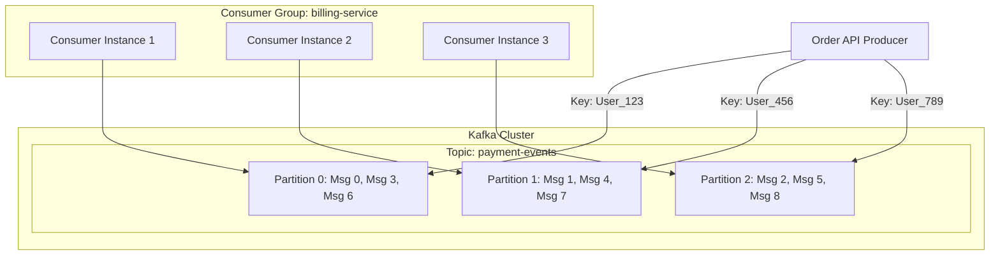

# 📡 Apache Kafka: Architecture, Event Streaming & Production Engineering

> **Prerequisites:** Basic understanding of Publish/Subscribe messaging and Client-Server architecture  
> **Target Skill:** Master high-throughput event streaming, consumer group rebalancing, partition key strategies, and production failure recovery  
> **Estimated Reading Time:** 15 mins  

---

## 💡 1. Mental Model & Core Concept

Traditional message queues (like RabbitMQ) treat messages as transient jobs: a producer pushes a job, a worker pops it, and the broker deletes it.

**Apache Kafka flips this model entirely.** Kafka treats data as an **append-only, immutable commit log** persisted on disk. Producers append events to the log, and Consumers read through the log by maintaining their own read index (called an **offset**).

```text
Message Queue (e.g. RabbitMQ):  [Producer] ──► [Broker] ──► (Message deleted after consumption)
Kafka Commit Log:             [Producer] ──► [Log: offset 0 | offset 1 | offset 2 | ...] (Persisted!)
                                                                  ▲
                                                          [Consumer Offset]
```

### Why Production Architectures Choose Kafka
1. **High Throughput:** Millions of events/sec via sequential disk I/O and OS Page Cache.
2. **Replayability:** Consumers can rewind their offset to re-process historical events (e.g., recovering from a bug in event processing).
3. **Decoupled Consumers:** Multiple independent services (Analytics, Fraud Detection, Search Indexing) read from the same log at their own pace without affecting each other.

---

## 🏗️ 2. Architectural Blueprint & Data Flow

Kafka organizes data into **Topics**, which are split across multiple **Partitions** for horizontal scalability and parallel processing.



### Key Architectural Concepts
* **Topic:** A logical category/stream of events (e.g., `user-signup-events`, `order-payments`).
* **Partition:** The physical unit of parallelism. Each partition is an ordered, immutable sequence of records.
* **Partition Key:** Determines which partition a message lands in using a hashing algorithm: `hash(key) % total_partitions`.
  * **Critical Guarantee:** Messages with the *same key* are guaranteed to land in the *same partition* and be processed in *exact chronological order*.
* **Consumer Group:** A set of instances working together to consume data from a topic. Kafka assigns each partition to exactly one consumer in the group.

---

## 💻 3. Production Implementation & Patterns

Here is a production-ready TypeScript/Node.js example using `kafkajs`:

### Producer Pattern (with Key Partitioning)

```typescript
import { Kafka, Partitioners } from 'kafkajs';

const kafka = new Kafka({
  clientId: 'order-service',
  brokers: ['kafka-broker-1:9092', 'kafka-broker-2:9092']
});

const producer = kafka.producer({
  createPartitioner: Partitioners.DefaultPartitioner // Uses Murmur2 hash on message key
});

export async function publishOrderEvent(orderId: string, userId: string, amount: number) {
  await producer.connect();
  
  await producer.send({
    topic: 'payment-events',
    messages: [
      {
        key: userId, // 👈 Guarantee all events for userId go to the exact same partition!
        value: JSON.stringify({ orderId, userId, amount, timestamp: Date.now() }),
        headers: { 'correlation-id': 'req-98123-abc' }
      }
    ]
  });
}
```

### Consumer Pattern (with Manual Offset Commit)

```typescript
const consumer = kafka.consumer({ groupId: 'billing-service-group' });

export async function startBillingConsumer() {
  await consumer.connect();
  await consumer.subscribe({ topic: 'payment-events', fromBeginning: false });

  await consumer.run({
    autoCommit: false, // 👈 Manual commit prevents data loss if worker crashes
    eachMessage: async ({ topic, partition, message }) => {
      const event = JSON.parse(message.value!.toString());
      
      try {
        await processBillingPayment(event);
        
        // Commit offset ONLY after processing succeeds (At-Least-Once Semantics)
        await consumer.commitOffsets([
          { topic, partition, offset: (BigInt(message.offset) + 1n).toString() }
        ]);
      } catch (err) {
        console.error(`Failed to process message at offset ${message.offset}`, err);
        // Push to Dead Letter Queue (DLQ) or alert monitoring
      }
    }
  });
}
```

---

## ⚠️ Production Trade-offs & Delivery Guarantees

| Delivery Guarantee | How It Works | Trade-off / Cost |
| :--- | :--- | :--- |
| **At-Most-Once** (`acks=0`) | Producer fires & forgets; consumer commits offset before processing. | Fast, but messages can be lost if server crashes. |
| **At-Least-Once** (`acks=all` + Manual Commit) | Producer retries until acknowledged; consumer commits offset *after* processing. | **Duplicates are possible**. Consumers **must be idempotent**. |
| **Exactly-Once** (Transactional API) | Uses two-phase commit across Producer, Kafka, and Consumer. | Higher latency, complex setup. Used in financial transactions. |

---

## 🚨 4. Real-World Production Failure Case Study

### The Outage: Consumer Group "Stop-the-World" Rebalance Storm
* **Symptom:** A food delivery app noticed that during peak dinner hours, the `notifications-service` consumer group stopped processing order updates completely for 45 seconds every few minutes.
* **Root Cause:** 
  1. The consumer process fetched a batch of 500 heavy notification messages.
  2. Processing the 500 emails/push notifications took **40 seconds** synchronous execution.
  3. Kafka’s broker config `max.poll.interval.ms` was set to **30 seconds**.
  4. The broker thought the consumer instance was dead because it didn't poll again within 30 seconds.
  5. The broker evicted the consumer and triggered a **Consumer Group Rebalance**, pausing all consumption across all partitions!
* **Resolution:**
  1. Lowered `max.poll.records` from `500` to `50` to ensure processing finishes well under `max.poll.interval.ms`.
  2. Upgraded Kafka consumer config to use **Cooperative Sticky Assignor** (`CooperativeStickyAssignor`), which prevents "Stop-the-World" pauses during rebalancing by reassigning only revoked partitions instead of stopping all instances.

---

## 🧪 5. Applied Micro-Challenge

> **Scenario:** You are building an E-Commerce platform where users can place orders, update orders, and cancel orders. 
> A junior developer creates a Kafka topic `order-updates` with 10 partitions. They send all messages with `key = null`.
> 
> In production, a user places an order (`Order Created`), and 2 seconds later cancels it (`Order Cancelled`). However, the fulfillment service processes `Order Cancelled` *first*, and then processes `Order Created`, causing a ghost order to be shipped!
> 
> **Question:** Why did this ordering bug happen, and how do you fix it with Kafka?

<details>
<summary><b>Reveal Solution & Explanation</b></summary>

### The Root Cause:
When `key = null`, Kafka distributes messages across partitions in a **Round-Robin** fashion.
* `Msg 1 (Order Created)` was sent to **Partition 0**.
* `Msg 2 (Order Cancelled)` was sent to **Partition 1**.
Since Partition 0 and Partition 1 are consumed by different consumer instances independently in parallel, `Consumer 2` processed `Msg 2` faster than `Consumer 1` processed `Msg 1`. Kafka ONLY guarantees message ordering *within the exact same partition*.

### The Fix:
Set the **Message Key** to the `orderId` (or `userId`):
```typescript
await producer.send({
  topic: 'order-updates',
  messages: [{ key: orderId, value: payload }] // 👈 Key forces all updates for orderId into Partition (hash(orderId) % 10)
});
```
Because both `Order Created` and `Order Cancelled` share the exact same `orderId` key, they land in the exact same partition and are strictly processed sequentially in order!
</details>
