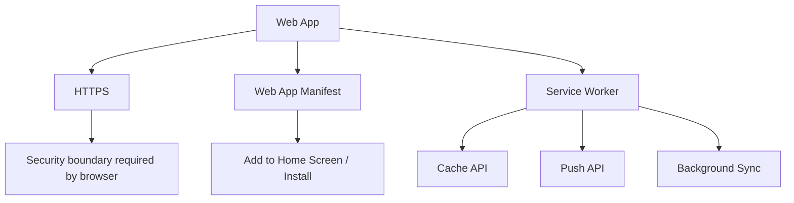
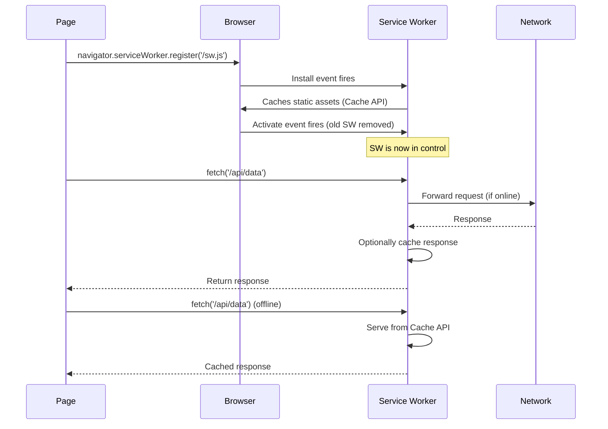
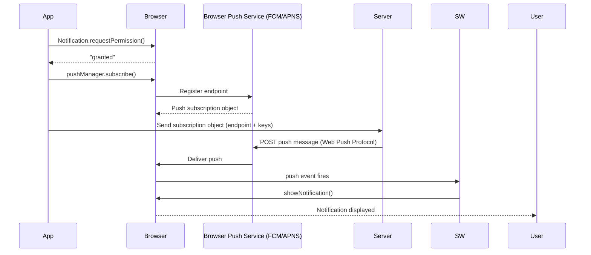

# Progressive Web Apps (PWAs)

## 1. The Problem This Technology Solves

Before PWAs, the web and native apps were two completely separate worlds:

| Approach | Problem |
|---|---|
| Native apps (iOS/Android) | Requires app store distribution, separate codebases, update friction, ~70% of users never install new apps |
| Classic websites | No offline support, no push notifications, no "add to home screen", no access to device hardware |
| Hybrid apps (Cordova/PhoneGap) | Still requires store deployment, WebView performance problems, poor UX |
| Responsive websites | Look good on mobile but still feel like websites — no install, no offline, no engagement hooks |

PWAs collapse this divide: a single web codebase that can be installed, works offline, receives push notifications, loads instantly, and feels native — delivered via a URL with no app store.

**Interview one-liner:** PWAs give web apps native-like capabilities (offline, push, installability) by layering Service Workers, a Web App Manifest, and HTTPS on top of a standard web app.

---

## 2. Core Definition

A **Progressive Web App** is a web application that uses a specific set of browser APIs and design patterns to deliver a native-app-like experience directly from the browser.

The word *progressive* means they degrade gracefully — they still work as normal websites in browsers that don't fully support PWA features.

### Commonly Confused Terms

| Term | What it actually is |
|---|---|
| **PWA** | A web app that implements Service Workers + Web App Manifest + HTTPS to enable app-like capabilities |
| **Service Worker** | A background JavaScript thread that proxies network requests and powers offline/cache/push — the engine of a PWA |
| **Web App Manifest** | A JSON file (`manifest.json`) describing the app's name, icons, colors, and display mode — enables "Add to Home Screen" |
| **Web Worker** | A general background JS thread for CPU work — NOT the same as a Service Worker |
| **Workbox** | Google's library that generates Service Worker caching logic — the "library version" of raw SW APIs |
| **TWA (Trusted Web Activity)** | A way to wrap a PWA inside an Android app shell for Play Store distribution |

**Interview one-liner:** A PWA is not a framework — it's a set of browser APIs (Service Worker, Web App Manifest, Push API, Cache API) that any web app can adopt.

---

## 3. How It Actually Works Under the Hood

### The Three Pillars



### Service Worker Lifecycle — Step by Step

A Service Worker is a JavaScript file that runs in its own thread, **separate from the main page**. It intercepts all network requests made by the page.



### Key Lifecycle Events

| Event | When it fires | What you do here |
|---|---|---|
| `install` | First time SW registers (or SW file changes) | Pre-cache static shell assets |
| `activate` | After install, when old SW is replaced | Delete old caches |
| `fetch` | Every network request from the page | Intercept and serve from cache or network |
| `push` | Push notification received from server | Show a notification via `self.registration.showNotification()` |
| `sync` | Background sync triggered | Replay queued requests (e.g. failed form submit) |

### Install / Installability Criteria

Browsers show the "Add to Home Screen" prompt when ALL of:
1. App is served over HTTPS
2. A valid `manifest.json` is linked in the `<head>`
3. A Service Worker is registered with a `fetch` handler

**Interview one-liner:** A Service Worker is a proxy script that runs off the main thread — it intercepts fetches, manages a local cache, and receives push events even when the page is closed.

---

## 4. Core Properties / Characteristics

| Property | PWA Behavior | Explanation |
|---|---|---|
| **Progressive** | Works on all browsers, enhanced where supported | Graceful degradation — no SW? It's still a website |
| **Responsive** | Adapts to any screen | Not unique to PWAs but required for mobile UX |
| **Connectivity-independent** | Works offline or on poor networks | Service Worker caches assets + API responses |
| **App-like** | No browser chrome, full-screen, home screen icon | Controlled via `manifest.json` `display` field |
| **Fresh** | Always up-to-date | SW updates automatically when sw.js changes |
| **Safe** | Served over HTTPS | HTTPS is a hard requirement — no SW without it |
| **Discoverable** | Indexed by search engines | Still a web page — unlike native apps |
| **Re-engageable** | Push notifications even when app is closed | Via Push API + Service Worker |
| **Installable** | Lives on home screen, no app store | "Add to Home Screen" prompt triggered by browser |
| **Linkable** | Shareable via URL | No install needed to share |

---

## 5. The Bare/Raw Version vs. The Popular Library/Framework Version

### Raw Browser APIs vs. Workbox

| Feature | Raw Service Worker APIs | Workbox (by Google) |
|---|---|---|
| Cache management | Manual `caches.open()`, `cache.put()`, `cache.match()` | `workbox.strategies.*` — StaleWhileRevalidate, CacheFirst, etc. |
| Cache versioning | Manually track cache names and delete old ones | `workbox.precaching.cleanupOutdatedCaches()` |
| Precaching | List assets in array, cache on `install` | `workbox.precaching.precacheAndRoute(self.__WB_MANIFEST)` |
| Routing | `event.respondWith()` with `if/else` on `event.request.url` | `workbox.routing.registerRoute(pattern, strategy)` |
| Background sync | Manual `SyncManager` API | `workbox.backgroundSync.BackgroundSyncPlugin` |
| Boilerplate | Very high — 100+ lines for production-ready SW | Very low — declarative, strategy-based |
| Build integration | None | Workbox webpack/vite plugins inject asset manifests automatically |

### Important nuance

Workbox does NOT change the SW lifecycle — `install`, `activate`, `fetch` still fire. It's a library layered on top that removes the manual plumbing. The browser doesn't know or care about Workbox.

**Interview one-liner:** Workbox is to Service Workers what Express is to Node's `http` module — same underlying API, much less boilerplate.

---

## 6. Core Components — Practical Breakdown

### 6.1 `manifest.json` — Web App Manifest

**What it is:** A JSON file that tells the browser how to present the app when installed.

```json
{
  "name": "My Learning Hub",
  "short_name": "LearnHub",
  "start_url": "/",
  "display": "standalone",
  "background_color": "#1a1a2e",
  "theme_color": "#6c63ff",
  "icons": [
    { "src": "/icons/icon-192.png", "sizes": "192x192", "type": "image/png" },
    { "src": "/icons/icon-512.png", "sizes": "512x512", "type": "image/png" }
  ]
}
```

Link it in your HTML:
```html
<link rel="manifest" href="/manifest.json">
```

**`display` field values:**

| Value | Behavior |
|---|---|
| `standalone` | No browser chrome, looks like a native app |
| `fullscreen` | Full-screen, no OS chrome (games) |
| `minimal-ui` | Back/forward buttons, no full browser UI |
| `browser` | Opens in normal browser tab (defeats the point) |

**When/why:** Always include a manifest. It's the easiest PWA requirement and what triggers the install prompt.

---

### 6.2 Service Worker Registration

**What it is:** The handshake between your page and the SW script.

```js
// In your main JS bundle
if ('serviceWorker' in navigator) {
  window.addEventListener('load', () => {
    navigator.serviceWorker.register('/sw.js')
      .then(reg => console.log('SW registered:', reg.scope))
      .catch(err => console.error('SW registration failed:', err));
  });
}
```

**When/why:** Register on `load` (not immediately) so the SW install doesn't compete with page resources.

---

### 6.3 Cache Strategies

**What they are:** Patterns for deciding whether to serve from cache or network.

| Strategy | How it works | Best for |
|---|---|---|
| **Cache First** | Serve cache, fall back to network | Static assets (CSS, JS, fonts) |
| **Network First** | Try network, fall back to cache | API data where freshness matters |
| **Stale-While-Revalidate** | Serve cache immediately, update cache in background | Avatars, non-critical API data |
| **Cache Only** | Only ever serve from cache | Precached offline shell |
| **Network Only** | Never touch cache | Auth requests, analytics |

```js
// Raw: Cache-first strategy
self.addEventListener('fetch', event => {
  event.respondWith(
    caches.match(event.request).then(cached => {
      return cached || fetch(event.request);
    })
  );
});
```

---

### 6.4 Push Notifications

**What it is:** Server-initiated notifications delivered via the browser's push service even when the app is closed.



> **Common mix-up — Web Push vs. FCM:** Web Push is the open protocol (RFC 8030). FCM/APNS are browser vendors' *implementations* of the push service endpoint. You're always talking Web Push protocol; the browser vendor's infrastructure delivers it.

---

### 6.5 Background Sync

**What it is:** Queues failed requests and replays them when the device comes back online.

```js
// Page: queue a sync tag when offline
navigator.serviceWorker.ready.then(sw => {
  sw.sync.register('submit-form');
});

// SW: handle the sync when back online
self.addEventListener('sync', event => {
  if (event.tag === 'submit-form') {
    event.waitUntil(replayQueuedRequests());
  }
});
```

**When/why:** Critical for form submissions, offline-first apps. Not yet supported in all browsers (Safari is behind).

---

## 7. Alternatives — When to Use What

| Option | Best when | Avoid when |
|---|---|---|
| **PWA** | Single web codebase, broad reach, no app store, content-heavy | Deep native hardware (ARKit, Bluetooth LE, NFC on iOS) |
| **Native iOS/Android** | Complex animations, full hardware access, regulated industries | Budget is tight, team is web-only |
| **React Native / Flutter** | Cross-platform native UX, device APIs, shared logic | You already have a mature web app |
| **Capacitor / Ionic** | Wrap existing web app for app store with native plugin access | Performance-critical UI (heavy gaming, AR) |
| **TWA (Trusted Web Activity)** | Get an existing PWA into the Play Store | iOS (TWA is Android-only) |
| **Electron (desktop)** | Desktop PWA with full OS file system access | You only care about mobile |

**Interview one-liner:** Choose PWA when you want one codebase, broad discoverability, and low distribution friction — choose native when you need deep hardware access or regulated store presence.

---

## 8. Pros & Cons

### General PWA Technology

| Pros | Cons |
|---|---|
| No app store, instant distribution via URL | iOS Safari has historically lagged (no background sync, limited push support) |
| One codebase for web + mobile install | Install rates lower than native (no app store browse discovery) |
| Offline + push without native code | Some device APIs unavailable (Bluetooth LE, NFC on iOS, ARKit) |
| Auto-updates — no user action required | Users less familiar with "Add to Home Screen" than store install |
| Indexable by search engines | Service Worker debugging is complex |
| Works on desktop and mobile | Safari Push Notifications only added in Safari 16.4 (2023) |

### Workbox (Library Layer)

| Pros | Cons |
|---|---|
| Dramatically reduces SW boilerplate | Adds bundle weight if not tree-shaken |
| Build-time asset manifest injection (no manual cache list) | Extra abstraction layer to debug through |
| Maintained by Google, well-documented | Version upgrades can be opaque |

---

## 9. Scaling / Production Gotchas

### ⚠️ The Stale SW Problem (Most Common Production Bug)

**What happens:** Once a Service Worker is installed, it controls the page indefinitely. If you ship a bug in your SW, users are stuck with it — even after you push a fix — because the browser only updates the SW file if the byte content changes, and only replaces it after all tabs are closed.

**The fix:**
1. Always version your cache names: `const CACHE = 'v2-static-shell'`
2. In `activate`, delete all old-named caches
3. Call `self.skipWaiting()` in `install` + `clients.claim()` in `activate` to force the new SW to take over immediately (but test carefully — this can cause mid-session cache mismatches)
4. Use Workbox's `clientsClaim()` and `skipWaiting()` helpers

```js
self.addEventListener('install', event => {
  self.skipWaiting(); // force new SW immediately
});
self.addEventListener('activate', event => {
  event.waitUntil(
    caches.keys().then(keys =>
      Promise.all(keys.filter(k => k !== CACHE_NAME).map(k => caches.delete(k)))
    ).then(() => clients.claim())
  );
});
```

**Flagged in interviews as:** "What happens if you ship a broken Service Worker?" — the answer is: SW updates are atomic but not instant; users on the old version won't get the fix until they close all tabs.

### Other Gotchas

| Gotcha | Fix |
|---|---|
| HTTPS required everywhere (even localhost needs `127.0.0.1` exception) | Use `localhost` — browsers exempt it from SW HTTPS requirement |
| SW scope limits — a SW at `/sw.js` only controls `/`, not `/app/sw.js` controlling `/other/` | Register SW as high as possible; use `scope` option if needed |
| Cache storage quota | Browsers enforce limits (~50MB–1GB); request `navigator.storage.persist()` to avoid eviction |
| Push subscription expires | Backend must handle `pushsubscriptionchange` event and re-register endpoints |
| iOS Safari background push (added 2023) only works if app is added to Home Screen | Document this behavior for users |

---

## 10. Quick-Fire Interview Q&A

**Q: What are the three hard requirements for a PWA?**
A: HTTPS, a Web App Manifest, and a registered Service Worker with a `fetch` handler. All three must be present for the browser to offer the install prompt.

**Q: What is a Service Worker and how does it differ from a regular Web Worker?**
A: A Service Worker is a special background script that acts as a network proxy — it intercepts fetch requests and can respond from cache, enable push, and run background sync. A regular Web Worker is just an off-main-thread JS thread for CPU work; it has no network interception capability.

**Q: Explain the Service Worker lifecycle.**
A: `install` fires first (pre-cache assets here), then `activate` fires after the old SW is replaced (clean up old caches here), then `fetch` fires for every network request. A new SW file is detected on navigation, but won't take over until all tabs using the old SW are closed (unless `skipWaiting()` is called).

**Q: What is the difference between Cache-First and Network-First strategies?**
A: Cache-First serves from cache and only hits the network on a miss — ideal for static assets. Network-First tries the network and falls back to cache on failure — ideal for API responses where freshness matters.

**Q: How does Web Push work?**
A: The browser subscribes to the browser vendor's push service (FCM for Chrome, APNS for Safari) and returns a subscription object with an endpoint URL and encryption keys. Your server sends a Web Push Protocol message to that endpoint; the push service delivers it to the browser, which wakes the Service Worker via a `push` event, and the SW calls `showNotification()`.

**Q: What happens when you ship a bug in a Service Worker?**
A: The SW is cached by the browser and won't update until the byte content of the SW file changes AND all controlled tabs are closed. Until then, users remain on the buggy SW. Using `skipWaiting()` forces the new SW to take over immediately but can cause cache state mismatches mid-session.

**Q: What is Workbox?**
A: Workbox is Google's library for Service Workers. It provides declarative caching strategies (StaleWhileRevalidate, CacheFirst, etc.) and build-tool plugins that automatically inject a manifest of assets to precache. It doesn't change the SW lifecycle — it's a higher-level abstraction over the same browser APIs.

**Q: Why does a PWA still need HTTPS?**
A: The browser enforces HTTPS as a prerequisite for Service Worker registration because SWs can intercept all network traffic — allowing a SW over HTTP would make man-in-the-middle attacks trivial. Localhost is the only exemption.

**Q: What is a TWA?**
A: Trusted Web Activity — a mechanism to wrap a PWA inside an Android APK using Chrome as the rendering engine. It lets you submit a PWA to the Google Play Store. There is no iOS equivalent.

**Q: What is Background Sync?**
A: A Service Worker API that queues network requests that failed (e.g. when offline) and replays them when connectivity is restored. Triggered via `sw.sync.register('tag')` from the page; the `sync` event fires in the SW when back online. Not yet supported in iOS Safari.

---

## 11. One-Paragraph Summary

A **Progressive Web App (PWA)** is a web application that uses three browser APIs — HTTPS, a **Web App Manifest**, and a **Service Worker** — to deliver a native-app-like experience from a URL. The Service Worker is the engine: it runs as a background thread separate from the page, intercepts every network request, and decides whether to serve from a local **Cache API** store or the network, using strategies like Cache-First or Network-First. This enables full offline support, instant loads, and background capabilities. The Manifest tells the browser how to display the app when installed (name, icons, full-screen mode), enabling the "Add to Home Screen" flow without an app store. The **Push API** lets servers send notifications to the SW even when the page is closed, using the Web Push Protocol routed through the browser vendor's infrastructure (FCM/APNS). The main production gotcha is the SW update lifecycle — a new SW only takes over after all controlled tabs are closed, so a buggy SW deployment requires `skipWaiting()` to force-replace it. **Workbox** is the de-facto library that wraps all this plumbing in declarative strategy-based routing. PWAs collapse the gap between web and native: one codebase, zero app store friction, full offline and push capabilities — with the tradeoff that some native APIs (especially on iOS) remain limited.
