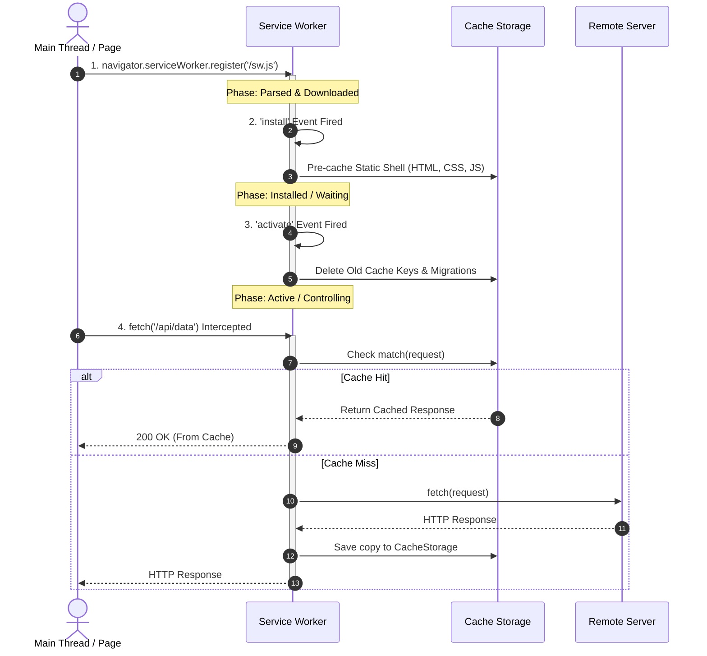

# Service Worker Architecture & Offline Proxying

## 1. The Problem This Technology Solves

Before Service Workers existed, the web browser's network layer was a rigid, synchronous "black box." Web applications were completely dependent on an active network connection, and developers had zero control over network requests at the browser layer before they left the client.

### Legacy Limitations & Pain Points
* **The "Lie-Fi" Problem**: Browsers would hang indefinitely when network connectivity dropped or degraded, showing a generic browser "No Internet" offline error page instead of a graceful fallback.
* **AppCache (Application Cache) Flaws**: HTML5 AppCache attempted offline caching using manifest files, but suffered from fatal architectural bugs—caching HTML permanently, failing to update unless the manifest itself changed byte-for-byte, and frequently locking users into stale versions indefinitely ("AppCache is a Douchebag").
* **No Background Execution**: Standard web pages executed JavaScript only while the tab was actively open and in the foreground. Closing or navigating away immediately destroyed execution context, making background background sync or push notifications impossible.
* **No Programmable Network Interception**: Developers could not inspect, rewrite, mock, or serve cached responses for network fetches requested by third-party scripts, standard HTML tags (``, `<script>`), or CSS files.

### Historical Evolution & Comparison Table

| Approach | Programmable? | Offline Capability | Background Execution | Main Weakness / Failure Mode |
| :--- | :--- | :--- | :--- | :--- |
| **Standard HTTP Headers** (`Cache-Control`) | ❌ No | Limited (Browser Cache) | ❌ No | Controlled entirely by server headers; cannot serve custom offline pages or dynamically fallback. |
| **HTML5 AppCache** (Deprecated) | ❌ Declarative only | ⚠️ Flawed | ❌ No | Aggressive stale caching, manifest pitfalls, and hard-to-recover zombie app states. |
| **Web Workers** | 🌐 General JS | ❌ No Network Control | ❌ No | Operates off main thread for heavy math/data processing, but cannot intercept network fetches or run background sync. |
| **Service Worker** | ✅ Fully Programmable | ✅ Advanced (`CacheStorage`) | ✅ Yes (Push & Sync) | Adds architectural complexity, lifecycle management overhead, and potential caching bugs if misconfigured. |

> **Interview one-liner:** Service Workers solve the client-side network control problem by acting as a programmable HTTP proxy thread in the browser, enabling true offline-first web apps, background data sync, and web push notifications.

---

## 2. Core Definition

A **Service Worker** is an event-driven, background JavaScript worker registered by a web page that runs on a separate browser thread. It operates independently of the main DOM rendering thread, acting as a client-side programmable proxy between the web application, the browser's network stack, and the network.

### Distinguishing Related Worker & Networking Terms

| Technology | Execution Context | DOM Access? | Primary Purpose | Lifecycle / Lifespan |
| :--- | :--- | :--- | :--- | :--- |
| **Service Worker** | Separate Worker Thread (`ServiceWorkerGlobalScope`) | ❌ No | Network proxying, caching, offline support, push notifications, background sync. | Persistent across page reloads; event-driven (spawns on event, terminates when idle). |
| **Web Worker** | Dedicated Worker Thread (`DedicatedWorkerGlobalScope`) | ❌ No | Offloading CPU-heavy computation (image processing, sorting, encryption) off main thread. | Tied directly to the lifespan of the page tab that created it. |
| **SharedWorker** | Shared Worker Thread (`SharedWorkerGlobalScope`) | ❌ No | Sharing state, memory, or socket connections across multiple browser tabs/windows of the same origin. | Alive as long as at least one tab/window remains connected to it. |
| **WebSocket** | Network Protocol (`ws://` / `wss://`) | N/A (Runs on main or worker thread) | Full-duplex, real-time TCP communication channel between client and server. | Tied to active TCP connection inside open tab context (unless proxied inside SharedWorker). |

> **Interview one-liner:** A Service Worker is a non-blocking background proxy thread that intercepts browser network requests, enabling offline caching, push notifications, and background processing independent of DOM web pages.

---

## 3. How It Actually Works Under the Hood

The Service Worker lifecycle is entirely decoupled from the web page's lifecycle. It is event-driven: the browser starts the worker process when an event needs to be handled (e.g., `fetch`, `push`, `sync`) and terminates it when idle to conserve memory and battery.

### Step-by-Step Mechanics & Lifecycle Phases



#### Detailed Lifecycle Phases

1. **Registration**: The main JavaScript thread invokes `navigator.serviceWorker.register('/sw.js', { scope: '/' })`. The browser fetches the script and parses it.
2. **Installation (`install` event)**:
   * Fired once when the browser detects a new or updated Service Worker file.
   * Typically used to set up the static app shell using `caches.open()` and `cache.addAll()`.
   * Execution is extended using `event.waitUntil(promise)`. If the promise rejects, installation fails and the worker is discarded.
3. **Waiting (`installed / waiting` phase)**:
   * An updated Service Worker will *not* take control immediately if an older version is currently controlling active tabs.
   * It enters a waiting phase to prevent breaking running application state across open tabs until all old tabs are closed, or until `self.skipWaiting()` is called.
4. **Activation (`activate` event)**:
   * Fired when the new worker is ready to take control.
   * Ideal phase for deleting obsolete cache keys from older versions.
   * Calling `self.clients.claim()` allows the newly activated worker to immediately control existing open pages without requiring a manual refresh.
5. **Active & Idle / Termination**:
   * The Service Worker now handles functional events (`fetch`, `push`, `sync`, `message`).
   * When no active events are being processed, the browser shuts down the thread to free memory. It re-spawns instantly when a new event arrives.
6. **Update Check**:
   * The browser automatically re-fetches `sw.js` on page navigation or every 24 hours.
   * If `sw.js` differs byte-for-byte from the currently active version, the browser initiates the installation process for the new script.

> **Interview one-liner:** The Service Worker lifecycle consists of Registration, Installation (pre-caching), Waiting (safety buffer), Activation (cache cleanup), and Idle/Event handling, running completely independently of page lifecycle.

---

## 4. Core Properties / Characteristics

| Property | Value / Trait | Description & Technical Impact |
| :--- | :--- | :--- |
| **Origin Security** | **HTTPS Only** | Due to powerful network interception capabilities, Service Workers only run on HTTPS (with `localhost` / `127.0.0.1` exempt for development) to prevent Man-in-the-Middle (MITM) attacks. |
| **Thread Context** | **No Direct DOM Access** | Cannot access `window`, `document`, or DOM nodes directly. Must communicate with pages via `postMessage()` or `BroadcastChannel` APIs. |
| **Execution State** | **Stateless / Ephemeral** | Global variables in `sw.js` reset when the browser terminates idle workers. State must be persisted in `IndexedDB` or `CacheStorage`, not global variables. |
| **Scope Boundary** | **Origin & Directory Scoped** | By default, a worker located at `/app/sw.js` can only intercept requests starting with `/app/`. The `Service-Worker-Allowed` header can override this scope. |
| **Storage APIs** | **Asynchronous Only** | Synchronous APIs like `localStorage` and `XMLHttpRequest` are forbidden inside worker context. Must use `fetch()`, `Promises`, `CacheStorage`, and `IndexedDB`. |

> **Interview one-liner:** Service Workers are HTTPS-enforced, stateless, non-blocking background workers with zero DOM access that rely exclusively on asynchronous storage like IndexedDB and CacheStorage.

---

## 5. The Bare/Raw Version vs. Popular Library (Workbox)

Writing raw Service Workers requires managing low-level cache invalidations, regex route matching, and complex event promises manually. **Workbox** (built by Google) is the industry standard high-level library for generating and managing Service Workers in production.

### Feature Comparison Matrix

| Feature | Low-Level Raw API (`sw.js`) | High-Level Workbox Library |
| :--- | :--- | :--- |
| **Pre-caching** | Manual `cache.addAll()` during `install` event; manual asset hash tracking. | Automated build integration (`workbox-build`, `workbox-webpack-plugin`) generating revision hashes for assets. |
| **Route Interception** | Manual `fetch` listener with `new URL(event.request.url)` regex matching. | Express-style declarative routing (`registerRoute('/api/.*', strategy)`). |
| **Caching Strategies** | Custom `event.respondWith()` logic with nested Promises. | Pre-packaged strategies: `CacheFirst`, `NetworkFirst`, `StaleWhileRevalidate`, `NetworkOnly`, `CacheOnly`. |
| **Cache Expiration** | Manual iteration over cache items deleting old timestamped entries. | Built-in `ExpirationPlugin` (limit entries by max count or max age in seconds). |
| **Background Sync** | Manual `sync` listener setup and queue serialization in IndexedDB. | `BackgroundSyncPlugin` automatically queues failed POST/PUT requests and retries when online. |

### Code Comparison: Stale-While-Revalidate Strategy

#### Raw JavaScript Implementation
```javascript
// Low-level manual implementation of Stale-While-Revalidate
self.addEventListener('fetch', (event) => {
  if (event.request.url.includes('/api/')) {
    event.respondWith(
      caches.open('api-cache-v1').then((cache) => {
        return cache.match(event.request).then((cachedResponse) => {
          const fetchPromise = fetch(event.request).then((networkResponse) => {
            cache.put(event.request, networkResponse.clone());
            return networkResponse;
          });
          return cachedResponse || fetchPromise;
        });
      })
    );
  }
});
```

#### Workbox Implementation
```javascript
import { registerRoute } from 'workbox-routing';
import { StaleWhileRevalidate } from 'workbox-strategies';
import { ExpirationPlugin } from 'workbox-expiration';

registerRoute(
  ({ url }) => url.pathname.startsWith('/api/'),
  new StaleWhileRevalidate({
    cacheName: 'api-cache-v1',
    plugins: [
      new ExpirationPlugin({ maxEntries: 50, maxAgeSeconds: 24 * 60 * 60 })
    ]
  })
);
```

> **Interview one-liner:** Raw Service Workers require manual promise handling, cache cleanup, and route matching, whereas Workbox provides production-grade declarative strategies, automatic asset revision hashing, and cache expiration.

---

## 6. Core Components — Practical Breakdown

### Component 1: `CacheStorage` & `Cache` API
`CacheStorage` (`caches`) is a persistent key-value storage system mapping HTTP `Request` objects to `Response` objects.

```javascript
// Pre-caching static assets during installation
self.addEventListener('install', (event) => {
  event.waitUntil(
    caches.open('static-v1').then((cache) => {
      return cache.addAll([
        '/',
        '/styles/main.css',
        '/scripts/app.js',
        '/offline.html'
      ]);
    })
  );
});
```
* **When to use:** Pre-caching HTML/CSS/JS bundles, images, fonts, and API GET responses.

---

### Component 2: `fetch` Event Interceptor (`event.respondWith`)
The `fetch` event fires whenever the page requests a resource (script, image, fetch/XHR API call).

```javascript
self.addEventListener('fetch', (event) => {
  event.respondWith(
    caches.match(event.request).then((response) => {
      // Return cached asset if present, otherwise fallback to network
      return response || fetch(event.request);
    })
  );
});
```
* **When to use:** Intercepting browser network traffic to serve cached assets or custom offline fallback pages.

---

### Component 3: Standard Caching Strategies

| Strategy | Flow Overview | Ideal Use Case |
| :--- | :--- | :--- |
| **Cache First** (Cache Falling Back to Network) | Check cache $\rightarrow$ return match. If missing $\rightarrow$ fetch network and update cache. | Static assets (fonts, images, compiled CSS/JS bundles with content hashes). |
| **Network First** (Network Falling Back to Cache) | Fetch network $\rightarrow$ return response & update cache. If offline/error $\rightarrow$ return cache. | Dynamic content where fresh data is critical (user profiles, feed posts, inventory count). |
| **Stale-While-Revalidate** | Return cached response immediately $\rightarrow$ trigger async network fetch in background to refresh cache for next load. | Frequently updated assets where instant speed matters more than strict real-time accuracy (avatar images, news articles). |
| **Network Only** | Always bypass cache and fetch directly from network. | Sensitive transactions, authentication endpoints (`/login`), analytics tracking. |
| **Cache Only** | Only serve from cache; never hit network. | Pre-cached static app shell assets in strictly offline environments. |

---

### Component 4: Client Communication (`postMessage` & `BroadcastChannel`)
Since Service Workers cannot access the DOM, communication between the main page and worker occurs via message passing.

```javascript
// Inside main thread (app.js)
if (navigator.serviceWorker.controller) {
  navigator.serviceWorker.controller.postMessage({ type: 'SKIP_WAITING' });
}

// Inside Service Worker (sw.js)
self.addEventListener('message', (event) => {
  if (event.data && event.data.type === 'SKIP_WAITING') {
    self.skipWaiting();
  }
});
```
* **When to use:** Notifying the user of an available app update ("New version available! Click to reload").

---

### Component 5: Background Sync & Web Push APIs

```javascript
// Background Sync: Retrying failed form submissions when network re-establishes
self.addEventListener('sync', (event) => {
  if (event.tag === 'sync-outbox-messages') {
    event.waitUntil(sendPendingOutboxMessages());
  }
});

// Web Push: Showing native system notifications when server pushes payload
self.addEventListener('push', (event) => {
  const data = event.data ? event.data.json() : {};
  event.waitUntil(
    self.registration.showNotification(data.title || 'New Message', {
      body: data.body,
      icon: '/images/icon.png'
    })
  );
});
```

> **Callout — Storage Comparison (Interview Mix-up):**
> * **`localStorage`**: Synchronous, string-only, 5MB limit, main-thread only, **forbidden in Service Workers**.
> * **`IndexedDB`**: Asynchronous, structured key-value database, large storage quota, accessible in both main thread and Service Workers.
> * **`CacheStorage`**: Asynchronous, dedicated Request/Response object cache, optimal for HTTP network assets.

---

## 7. Alternatives — When to Use What

| Technology | Proxy Network? | Background Push/Sync? | Best Suited For | Avoid When |
| :--- | :--- | :--- | :--- | :--- |
| **Service Worker** | ✅ Yes | ✅ Yes | Offline-first Progressive Web Apps (PWAs), caching static shells, push notifications. | Simple static websites with no offline requirements or low update frequencies. |
| **HTTP Browser Cache** | ❌ No (Browser Engine) | ❌ No | Basic static asset caching via standard CDN / `Cache-Control` headers. | Requiring custom offline fallback UX or dynamic client-side caching logic. |
| **Web Workers** | ❌ No | ❌ No | CPU-intensive computations (data processing, encryption, canvas manipulation). | Needing to intercept network calls or handle offline caching. |
| **Native App Daemons** (iOS/Android) | N/A (Native OS) | ✅ Yes | Native mobile applications requiring deep OS integration and background execution. | Building cross-platform web applications running strictly inside standard browsers. |

> **Interview one-liner:** Choose Service Workers for client-side network proxying and offline PWAs, Web Workers for offloading CPU-heavy algorithms, and standard HTTP headers for simple CDN caching.

---

## 8. Pros & Cons

### General Service Worker Technology

#### Pros
* **True Offline Functionality**: Transforms web apps into reliable PWA experiences that launch instantly regardless of network status.
* **Drastic Performance Boost**: Pre-cached static app shells eliminate network round-trips (`TTFB` dropped to near 0ms for cached assets).
* **Native-Like Engagement**: Enables Web Push notifications and Background Synchronization on desktop and mobile browsers.
* **Network Resilience**: Allows graceful degradation during partial network outages ("Lie-Fi").

#### Cons
* **Caching Complexity & Bugs**: Improper cache strategies can lock users into "stale code hell" where updates never load.
* **No DOM Access**: Requires messaging overhead to communicate with application UI.
* **HTTPS Requirement**: Development requires SSL certificates or `localhost` mocking.
* **First-Load Overhead**: The Service Worker does not control the page on its very first load unless registered and claimed immediately.

---

### Workbox Library vs. Raw Service Worker API

| Approach | Pros | Cons |
| :--- | :--- | :--- |
| **Workbox Library** | • Production-tested strategies out of the box.<br>• Automated asset revisioning via build plugins.<br>• Built-in expiration and background sync handlers. | • Adds bundle dependency to build step.<br>• Abstraction hides raw low-level lifecycle mechanics from developers. |
| **Raw API** | • Zero external dependencies.<br>• Complete fine-grained control over raw event handlers. | • High code boilerplate.<br>• Prone to race conditions, memory leaks, and cache invalidation bugs. |

---

## 9. Scaling / Production Gotcha: The "Zombie App" Stale Lockout

### The Production Issue
The single most dangerous production incident with Service Workers is the **"Zombie App" state** (Stale HTML/JS Lockout). 

#### How it happens:
1. You deploy a new version of your web application (`v2`) to your server.
2. User opens the tab. The browser detects updated `sw.js` and installs `v2` in the background.
3. Because the user has active tabs open, `v2` enters the **Waiting** state.
4. If your Service Worker aggressively pre-cached `index.html` with a **Cache-First** strategy, the browser will serve the old `v1` `index.html` from cache forever, pointing to old bundled JS files that may have been deleted from your production server/CDN.
5. Even if the user refreshes, `v1` HTML is served from cache, preventing `v2` from ever activating without a hard cache clear!

```
[Server Deployment v2] ---> User Refreshes ---> SW serves cached v1 index.html ---> Request v1 app.js (404 Not Found) ---> App Crashes
```

### The Production Solution
1. **Never Cache `index.html` with Cache-First**: Always use **Network-First** or **Stale-While-Revalidate** for `index.html`, and set server headers: `Cache-Control: no-cache, no-store, must-revalidate`.
2. **Implement Update Prompts (`skipWaiting`)**: When a new Service Worker is waiting, send a message to prompt the user: *"New version available! Update now."*
3. **Automate Cache Versioning**: Ensure old caches are purged inside the `activate` event handler:

```javascript
// Clean up legacy caches upon activation
self.addEventListener('activate', (event) => {
  const currentCaches = ['static-v2', 'api-v2'];
  event.waitUntil(
    caches.keys().then((cacheNames) => {
      return Promise.all(
        cacheNames.map((cacheName) => {
          if (!currentCaches.includes(cacheName)) {
            return caches.delete(cacheName); // Purge stale caches
          }
        })
      );
    }).then(() => self.clients.claim()) // Claim clients immediately
  );
});
```

> **Interview Flag:** Interviewers love asking: *"How do you update a Service Worker in production without breaking active user sessions or serving stale HTML?"* Point directly to `skipWaiting()`, `clients.claim()`, purging old caches in `activate`, and using Network-First for `index.html`.

---

## 10. Quick-Fire Interview Q&A

#### Q1: What is a Service Worker and what is its main restriction?
**A:** A Service Worker is an event-driven background worker thread that acts as a programmable network proxy for browser requests. Its main restrictions are that it runs exclusively on HTTPS (except `localhost`), has zero access to the DOM, and is entirely stateless (its process terminates when idle).

#### Q2: What happens during the `install` vs `activate` lifecycle events?
**A:** The `install` event is used to populate `CacheStorage` with initial static assets (app shell). The `activate` event triggers after installation once older workers release control, making it the ideal place to delete legacy caches and claim active clients via `clients.claim()`.

#### Q3: Why doesn't a newly installed Service Worker take control of the page immediately?
**A:** To prevent breaking active user sessions. If a user has multiple tabs open running version 1, immediately overriding requests with version 2 could cause script version mismatches. The new worker waits until all tabs running version 1 are closed or until `self.skipWaiting()` is invoked.

#### Q4: What is the difference between Cache-First and Stale-While-Revalidate strategies?
**A:** Cache-First checks the cache and only hits the network if the asset is missing (best for hashed static assets like fonts and compiled JS). Stale-While-Revalidate returns the cached asset instantly for speed, while simultaneously initiating a background network fetch to update the cache for subsequent requests.

#### Q5: How can a Service Worker communicate with a web page's JavaScript code?
**A:** Via asynchronous message passing using `postMessage()` and listener events (`navigator.serviceWorker.addEventListener('message', ...)`), or through the `BroadcastChannel` API.

#### Q6: How do you bypass the browser's HTTP cache when checking for `sw.js` updates?
**A:** Browsers check for `sw.js` updates on page navigation or every 24 hours. To ensure updates aren't blocked by HTTP caching, servers should configure `Cache-Control: no-cache, max-age=0` for the `sw.js` file itself.

#### Q7: What is the difference between Web Workers and Service Workers?
**A:** Web Workers are designed for offloading CPU-heavy computational tasks from the main rendering thread and are tied to a single tab's lifespan. Service Workers act as persistent, origin-wide network proxies capable of intercepting HTTP requests, caching, and handling background push/sync events.

#### Q8: What API inside a Service Worker should be used to store persistent structured data?
**A:** `IndexedDB`. `localStorage` is forbidden inside worker threads because it is a synchronous API that blocks the event loop.

---

## 11. One-Paragraph Summary

A **Service Worker** is an event-driven, non-blocking background proxy thread running on a separate browser thread that intercepts and controls network traffic between a web application and the internet. Operating exclusively over HTTPS without direct access to the DOM, it follows a strict lifecycle (Registration, Installation, Waiting, Activation, and Idle/Event handling). By leveraging `CacheStorage` and `IndexedDB`, Service Workers enable sophisticated offline caching strategies (Cache-First, Network-First, Stale-While-Revalidate), Background Sync, and Web Push notifications. In production, tools like Workbox manage cache invalidations and asset revisioning, while careful configuration of `skipWaiting()`, `clients.claim()`, and short HTTP cache headers for `index.html` prevents stale "zombie app" lockouts.
