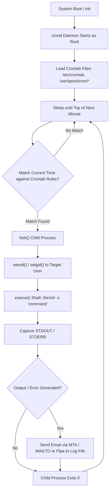

# Cron Jobs: Operating System Scheduling & Distributed Task Execution

## 1. The Problem This Technology Solves

In computing, software applications frequently require **recurring background maintenance, periodic data synchronization, batch report generation, and housekeeping tasks**. Examples include nightly database backups, hourly cache warming, clearing expired session tokens, or billing subscription renewals every midnight.

### Legacy Limitations & Pain Points

Before dedicated OS-level scheduling daemons were introduced, developers had to rely on brittle, manual, or resource-inefficient workarounds:

* **Manual Human Execution**: Operations teams manually triggered shell scripts or database cleanup commands via terminal at fixed times. This approach was highly error-prone, unscalable, and failed during non-working hours or employee absence.
* **Persistent Infinite Loops with Sleep**: Running a background script containing `while (true) { doWork(); sleep(86400); }`. If the process crashed due to an unhandled exception or memory leak, the schedule died permanently without restarting. Furthermore, long-running processes continuously consumed RAM and CPU stack context.
* **Lack of Standardized Time Expressions**: Hardcoding custom timing logic inside application code made modifying schedules difficult, requiring code recompilation and redeployment.
* **Unmanaged Resource Contention**: Lacking a centralized OS scheduler, multiple independent scripts could kick off simultaneously, overwhelming CPU registers, memory bandwidth, and disk I/O.

### Historical Evolution & Scheduling Mechanism Comparison

| Scheduling Mechanism | Execution Context | Fault Tolerance & Recovery | Resource Efficiency | Primary Limitation / Bottleneck |
| :--- | :--- | :--- | :--- | :--- |
| **Manual Execution** | Human interactive terminal | ❌ Zero (Dependent on human intervention) | N/A | Human error, non-automated, impossible for high-frequency tasks. |
| **`while(true)` + `sleep`** | App process thread | ❌ Low (Process crash kills the schedule permanently) | ⚠️ Low (Keeps process memory & stack allocated) | Drift over time (`sleep(N)` drift), memory leaks, process crash stops future runs. |
| **OS `cron` Daemon** | Native OS background daemon (`crond`) | ✅ High (Kernel-managed daemon, autostart on boot) | 🚀 Ultra High (Spawns short-lived process only when needed) | Single-node bound; no built-in distributed locking or retry mechanics. |
| **`systemd` Timers** | Linux Kernel Init System | ✅ High (Integrated with `journald`, service dependencies) | 🚀 Ultra High | Linux-specific (`systemd`), config syntax verbose compared to 1-line crontab. |
| **Distributed Scheduler** | Multi-node cluster (Celery, Quartz, BullMQ) | ✅ Enterprise (Failover, retries, Redlock distributed locking) | Medium (Requires Redis/DB broker infrastructure) | Infrastructure complexity, network latency, queue broker overhead. |

> **Interview one-liner:** Cron was created to provide a lightweight, OS-level, time-driven execution daemon that decouples task timing from application code, automatically spawning short-lived processes without holding persistent memory resources.

---

## 2. Core Definition & Fundamental Concepts

### What is Cron?

**Cron** is a time-based job scheduler daemon available in Unix-like operating systems (Linux, macOS, BSD). The name *Cron* originates from the Greek word *Chronos*, meaning time. 

It runs continuously in the background as a system daemon process (`crond` or `cron`). Every minute, `crond` wakes up, evaluates configuration tables known as **crontabs** (cron tables), and executes any registered shell commands, binaries, or scripts whose scheduled minute, hour, day, month, or day-of-week match the current system time.

### The Crontab Syntax Breakdown

A standard Unix crontab line consists of **5 time fields** followed by the system command to execute:

```text
 ┌───────────── minute (0 - 59)
 │ ┌───────────── hour (0 - 23)
 │ │ ┌───────────── day of month (1 - 31)
 │ │ │ ┌───────────── month (1 - 12)
 │ │ │ │ ┌───────────── day of week (0 - 6) (Sunday=0 or 7)
 │ │ │ │ │
 * * * * *  /path/to/command.sh
```

#### Special Wildcard Operators
* `*` (Any value): Matches every possible value for that field (e.g., `*` in minute field = every minute).
* `,` (Value list separator): Specifies multiple discrete values (e.g., `1,15,30` in minute field).
* `-` (Range operator): Specifies an inclusive range of values (e.g., `1-5` in day-of-week field = Monday to Friday).
* `/` (Step operator): Specifies increments (e.g., `*/15` in minute field = every 15 minutes).

### Adjacent Terms Defined Side-by-Side

| Term | Category | What It Actually Is | Primary Difference / Confusion Point |
| :--- | :--- | :--- | :--- |
| **`cron` / `crond`** | System Daemon | The persistent background process running in memory that monitors system time and triggers tasks. | `cron` is the **engine/service**; `crontab` is the **configuration file**. |
| **`crontab`** | Config / CLI | The configuration file (Cron Table) listing scheduled tasks, or the command-line utility used to edit it (`crontab -e`). | `crontab` is the **file/tool** users edit to register jobs for `crond` to read. |
| **`anacron`** | OS Utility | A companion daemon for systems that do NOT run 24/7 (like laptops/desktops). | `cron` **misses** jobs if the machine is powered off. `anacron` detects missed runs upon boot and catches up. |
| **`at`** | OS Utility | A command-line tool used to schedule a task to run **exactly once** at a specific future time. | `cron` is for **recurring** schedules; `at` is for **one-time deferred** execution. |
| **`systemd timer`** | Linux Service | A `systemd` unit file (`.timer`) that controls `.service` units based on time triggers. | Modern Linux replacement for `cron`; supports microsecond precision and system logging via `journald`. |

### Full Form of Key Acronyms

Below are the full expansions for short terms commonly encountered when working with cron jobs and OS task scheduling:

* **CRON**: Command Run On (Historical mnemonic backronym)
* **OS**: Operating System
* **CLI**: Command Line Interface
* **UTC**: Coordinated Universal Time
* **DST**: Daylight Saving Time
* **POSIX**: Portable Operating System Interface
* **PID**: Process ID
* **IPC**: Inter-Process Communication
* **CPU**: Central Processing Unit
* **RAM**: Random Access Memory
* **I/O**: Input / Output
* **HTTP**: Hypertext Transfer Protocol
* **SQS**: Simple Queue Service (AWS)
* **SLA**: Service Level Agreement

> **Interview one-liner:** Cron is an OS background daemon (`crond`) that evaluates minute-granularity crontab expressions to spawn isolated child shell processes for recurring automated execution.

---

## 3. How It Actually Works Under the Hood

Understanding the internal execution mechanics of the `crond` daemon is critical for diagnosing execution failures, environment bugs, and security contexts during technical interviews.



### Step-by-Step Execution Lifecycle

1. **Daemon Initialization**:
   * During system startup (`systemd` or `init`), `crond` is spawned as a root process.
   * It reads system-wide crontabs (`/etc/crontab`, `/etc/cron.d/`) and user-specific crontabs stored in spool directories (`/var/spool/cron/crontabs/`).

2. **The Minute Loop & Precision**:
   * `crond` sleeps until the start of the next minute boundary (using OS sleep primitives like `nanosleep()` or `epoll_wait()`).
   * *Crucial Detail*: Standard POSIX cron has a **1-minute resolution granularity**. It does NOT support second-level or millisecond-level scheduling native triggers.

3. **Crontab Expression Parsing**:
   * Upon waking, `crond` parses all active crontab files in memory.
   * It evaluates the current system time (`minute`, `hour`, `day`, `month`, `day_of_week`) against each job's 5-field expression using bitmask operations.

4. **Process Spawning via `fork()` and `execve()`**:
   * When a match is detected, `crond` calls the Unix `fork()` system call to create an exact duplicate child process.
   * The child process drops privileges via `setuid()` and `setgid()` to switch from root to the user context who owns the crontab.
   * The process initializes a stripped-down default environment (`PATH=/usr/bin:/bin`, `SHELL=/bin/sh`, `HOME=/home/user`).
   * The child calls `execve()` to execute the shell binary with the crontab command string: `/bin/sh -c "your_command"`.

5. **I/O Redirection & Mail Handling**:
   * `crond` creates anonymous pipes to capture standard output (`stdout`) and standard error (`stderr`) generated by the child process.
   * If any text is printed to stdout/stderr during execution, `crond` invokes the local Mail Transfer Agent (MTA, e.g., Sendmail/Postfix) to email the output to the address defined in the `MAILTO` environment variable.
   * If `MAILTO=""` or output is explicitly redirected (`> /dev/null 2>&1`), no mail is dispatched.

> **Interview one-liner:** Under the hood, `crond` wakes up every minute, evaluates bitmasked time expressions, calls `fork()` to drop permissions to the job owner, and executes the command via `execve()` inside an isolated shell wrapper.

---

## 4. Core Properties & Characteristics

| Property | Value / Behavior | Plain-English Explanation |
| :--- | :--- | :--- |
| **Execution Trigger** | **Time-Driven (Push)** | Triggered purely by clock/calendar match; agnostic to system load or incoming application events. |
| **State Context** | **Stateless & Ephemeral** | Each run spawns a fresh process context with no built-in memory of previous runs or execution outcomes. |
| **Time Granularity** | **1 Minute (Standard POSIX)** | Minimum scheduling interval is 60 seconds. Cannot natively run jobs every 5 seconds. |
| **Environment** | **Minimal / Stripped Shell** | Does **NOT** inherit the interactive user login environment (`.bashrc`, `.zshrc`, system `$PATH` are missing). |
| **Concurrency Control** | **No Native Overlap Prevention** | If a job scheduled every 5 minutes takes 10 minutes to run, cron will launch a second concurrent instance alongside the first. |
| **Output Channel** | **Local Mail / STDERR Buffer** | Unhandled output/errors default to local OS mail (`/var/mail/user`) unless stdout/stderr redirection is configured. |
| **Topology Scope** | **Single-Node Local** | Operates strictly within the boundary of a single operating system kernel instance. |

---

## 5. The Bare/Raw Version vs. Popular High-Level Framework Versions

While raw `crontab` is ideal for OS administration, modern distributed application development relies on high-level libraries and cloud-managed job schedulers.

### Feature Comparison Matrix

| Feature / Trait | Raw OS `crontab` | Node-cron / Quartz (App Library) | Kubernetes CronJob | Distributed Task Scheduler (Celery / BullMQ / Temporal) |
| :--- | :--- | :--- | :--- | :--- |
| **Execution Layer** | OS Shell (`/bin/sh`) | App Process Thread / Event Loop | Isolated Docker/K8s Pod | Distributed Worker Pool |
| **Sub-minute Precision** | ❌ No (1 min min) | ✅ Yes (Second-level: `* * * * * *`) | ❌ No (1 min min) | ✅ Yes (Sub-second precision) |
| **Multi-Node Locking** | ❌ None (Runs on each node) | ❌ None (Needs Redis lock) | ✅ Built-in (`concurrencyPolicy`) | ✅ Built-in (Distributed Queue Locks) |
| **Retry on Failure** | ❌ None | ⚠️ Manual code logic | ✅ Built-in (`backoffLimit`) | ✅ Enterprise Auto-Retry with Exponential Backoff |
| **Central UI & Monitoring**| ❌ System syslog only | ❌ None (Unless custom built) | ✅ K8s Dashboard / kubectl | ✅ Rich UI (Bull Dashboard, Temporal UI) |
| **Payload / Parameter Passing** | String shell arguments | Native JS/Java Objects | JSON Spec / Env Vars | Structured JSON Payload |

> **Interview one-liner:** Raw OS Cron provides zero cross-node synchronization or automatic retries; production enterprise systems use distributed job queues (like BullMQ or Temporal) to enforce distributed locks, exponential backoffs, and centralized observability across microservices.

---

## 6. Core Components — Practical Breakdown

### 1. Crontab Syntax & Environment Directives

A standard crontab file contains both environment configuration directives and scheduled job definitions:

```bash
# Crontab Environment Settings
SHELL=/bin/bash
PATH=/usr/local/sbin:/usr/local/bin:/usr/sbin:/usr/bin:/sbin:/bin
MAILTO="dev-alerts@company.com"

# Job Definitions:
# 1. Run database backup every day at 2:30 AM
30 2 * * * /usr/local/bin/pg_dumpall > /var/backups/db.sql 2>&1

# 2. Run log cleanup every 15 minutes on weekdays
*/15 * * * 1-5 /scripts/clean_tmp.sh >> /var/log/cleanup.log 2>&1
```

* **`SHELL`**: Specifies which shell executable opens the command string (defaults to `/bin/sh` if omitted).
* **`PATH`**: Explicitly defines binary lookup paths. **Missing `$PATH` is the #1 reason cron scripts fail in production.**

### 2. Standard Output & Error Redirection

Because cron processes lack an interactive terminal (TTY), output handling must be explicitly declared:

```bash
# Append stdout and stderr to a file
0 0 * * * /app/nightly_job.sh >> /var/log/nightly.log 2>&1

# Discard all output completely (Silence stdout and stderr)
0 * * * * /app/ping_healthcheck.sh > /dev/null 2>&1
```

* `>`: Redirects stdout to a file (overwrites).
* `>>`: Appends stdout to a file.
* `2>&1`: Directs file descriptor 2 (`stderr`) into descriptor 1 (`stdout`).

### 3. Non-Overlapping Execution Lock (`flock`)

To prevent duplicate job execution when a script runs longer than its scheduled interval:

```bash
# Use linux flock tool to acquire a file lock; skip if lock is busy
*/5 * * * * flock -n /tmp/job_sync.lock /usr/bin/python3 /app/sync_orders.py
```

* `flock -n`: Tries to acquire a non-blocking lock on `/tmp/job_sync.lock`. If another instance holds the lock, `flock` exits immediately without running the script.

### Common Interview Mix-ups

```
┌────────────────────────────────────────────────────────────────────────┐
│                        COMMON INTERVIEW MIX-UP                         │
├────────────────────────────────────────────────────────────────────────┤
│ ❌ Cron vs systemd Timers:                                              │
│    Cron relies on standard minute-granularity crontab parsing and text  │
│    emails. systemd timers offer microsecond precision, dependency      │
│    management, execution logging via journald, and control over CPU/   │
│    cgroups memory limits.                                              │
│                                                                        │
│ ❌ Cron vs Message Queue Delay (SQS / RabbitMQ / Redis):               │
│    Cron triggers a job based on CALENDAR TIME (e.g. "Every Monday at 9AM").│
│    Message Queue delays execute a task based on RELATIVE ELAPSED TIME  │
│    from an event (e.g. "Process refund 24 hours AFTER user clicked"). │
└────────────────────────────────────────────────────────────────────────┘
```

---

## 7. Alternatives — When to Use What

| Technology | Best Use Case | When NOT to Use | Key Advantage |
| :--- | :--- | :--- | :--- |
| **OS `crond`** | Single-server maintenance, disk log rotation, local shell backup scripts. | Multi-node microservice clusters requiring high availability. | Zero dependencies; natively built into every Unix installation. |
| **`systemd` Timers** | Modern Linux server system administration, service-dependent jobs. | Non-Linux operating systems; lightweight microcontainers lacking systemd. | Deep integration with OS resource limits (`cgroups`) and `journald`. |
| **App Schedulers (e.g. Node-Cron, Quartz)** | In-process scheduling within a monolithic web server. | Multi-instance horizontally scaled containers (causes duplicate duplicate runs). | Direct access to in-memory application domain objects and DB models. |
| **Kubernetes CronJob** | Containerized microservices deployed on Kubernetes clusters. | Non-containerized legacy bare-metal infrastructure. | Isolated pod execution; automatic container cleanup and cluster scheduling. |
| **Distributed Orchestrators (Temporal, Airflow, BullMQ)** | Complex multi-step business workflows, ETL pipelines, financial processing. | Simple 1-line shell cleanup scripts (overkill). | Distributed locks, stateful workflow durability, retries, audit dashboards. |

> **Interview Reasoning Out Loud:** *"If we need simple single-server log rotation, OS cron or systemd timers are best due to zero overhead. However, in a horizontally scaled containerized microservice environment, raw cron causes race conditions and duplicate execution. For application business logic, we should use Kubernetes CronJobs or a distributed job queue like BullMQ backed by Redis distributed locks."*

---

## 8. Pros & Cons

### (a) OS Native Cron

#### Pros
* **Zero Additional Infrastructure**: Pre-installed on virtually all Linux/Unix distributions out of the box.
* **Extreme Memory Efficiency**: Consumes zero RAM when idle; spawns process execution context only when triggered.
* **Simplicity**: Declarative, standardized 5-field syntax recognized universally by DevOps engineers.

#### Cons
* **No Built-in Distributed Locking**: If deployed across 5 autoscaled web servers, all 5 servers will execute the exact same job simultaneously.
* **1-Minute Granularity**: Cannot natively execute jobs with sub-minute (e.g., 5-second) intervals.
* **Silent Failure Risk**: If the server is powered off or crashes at the exact minute of execution, the job is missed entirely without automatic catchup.
* **Stripped Environment Pitfalls**: Runs without user shell environment variables (`$PATH`, `$USER`, `.bashrc`), leading to frequent "command not found" errors.

---

### (b) Distributed Job Schedulers (e.g., BullMQ, Temporal, AWS EventBridge)

#### Pros
* **Multi-Node Concurrency Protection**: Uses Redis/DB distributed locks (e.g., Redlock algorithm) to guarantee exact-once execution across microservice clusters.
* **Robust Error Recovery**: Automatic exponential backoff retries, dead-letter queues (DLQ), and persistent execution state.
* **Full Observability**: Visual UI dashboards to track job status, payload histories, and execution durations.

#### Cons
* **Infrastructure Overhead**: Requires maintaining auxiliary state stores (Redis, PostgreSQL, or Cloud APIs).
* **System Complexity**: Higher engineering complexity, network latency, and potential serialization overhead.

---

## 9. Scaling & Production Gotchas

### Gotcha #1: Overlapping Execution Race Conditions & Split-Brain Duplicate Runs

**The Scenario**: A cron job is scheduled to run every 5 minutes (`*/5 * * * *`) to process pending billing invoices. Under high system load or large database volume, the script takes **7 minutes** to finish. 

At the 5-minute mark, `crond` blindly spawns a **second concurrent instance** of the script while the first instance is still active.

```
Time:   0min        5min        7min        10min
Instance 1: |-------------------| (Finishes)
Instance 2:             |-------------------| (Finishes)
                        ^ Overlap occurs between 5min - 7min!
```

**Production Impact**: Double credit card charges, database deadlock exceptions, high CPU/RAM usage spikes causing server failure.

#### Production Solution:
1. **Local Single-Node Fix**: Wrap the script in Linux `flock` to skip or queue overlapping runs:
   ```bash
   */5 * * * * flock -n /tmp/billing_job.lock /usr/bin/python3 /app/charge_invoices.py
   ```
2. **Distributed Microservice Fix**: Implement a **Distributed Lock** using Redis (`Redlock` algorithm) or a database pessimistic lock with a Time-To-Live (TTL) expiration:

```javascript
// Distributed Lock Example (Node.js + Redis)
async function runDistributedCron() {
  const lockAcquired = await redis.set('lock:billing_job', instanceId, 'NX', 'EX', 300); // 5 min TTL
  if (!lockAcquired) {
    console.log('Another node is currently executing the billing job. Skipping.');
    return;
  }
  try {
    await processInvoices();
  } finally {
    await redis.del('lock:billing_job'); // Release lock
  }
}
```

---

### Gotcha #2: Daylight Saving Time (DST) Jumps & Timezone Ambiguity

**The Scenario**: A cron job is scheduled to run daily at 2:30 AM (`30 2 * * *`). 

On the spring DST transition date (when clocks jump forward from 1:59 AM to 3:00 AM), 2:30 AM **never occurs**, so the cron job **skips execution completely**. 

On the autumn DST transition date (when clocks fall back from 2:59 AM to 2:00 AM), 2:30 AM **occurs twice**, causing the job to **execute twice**.

#### Production Solution:
* **Rule**: Set all server hardware clocks, OS system time, container base images, and database timezones to **UTC (Coordinated Universal Time)**. UTC does not observe Daylight Saving Time.

---

## 10. Quick-Fire Interview Q&A

### Q1: Why did my cron job script fail when executed via `crontab`, even though it works perfectly when I run it manually in my terminal?
**Answer:** Cron executes commands inside a non-interactive shell with a minimal, stripped-down environment (`PATH=/usr/bin:/bin`, `SHELL=/bin/sh`). It does not source interactive user startup files like `~/.bashrc`, `~/.zshrc`, or exported environment variables. The failure is almost always caused by using relative paths or depending on binaries absent from the default cron `$PATH`. Fix this by declaring explicit absolute paths in your script or defining `PATH` at the top of the crontab file.

### Q2: How do you prevent a cron job from running concurrently if its previous execution has not finished yet?
**Answer:** On a single server, use the Linux `flock` (file lock) command wrapper (`flock -n /tmp/job.lock script.sh`), which attempts to acquire a file lock and exits immediately if another process holds it. In a multi-node distributed environment, use a distributed locking mechanism backed by Redis (such as the Redlock algorithm) or a database lock with a lease TTL to ensure only one node executes the job across the cluster.

### Q3: What is the minimum time granularity supported by standard POSIX cron, and how would you execute a task every 10 seconds?
**Answer:** Standard POSIX cron supports a minimum time resolution of **1 minute**. To run a job every 10 seconds using cron, you can schedule a script to run every minute and insert loop delays inside the script or crontab:
```bash
* * * * * /app/script.sh
* * * * * sleep 10 && /app/script.sh
* * * * * sleep 20 && /app/script.sh
...
```
Alternatively, use an application-level event loop scheduler (like Node-cron or Quartz) or systemd timer units which support sub-second precision.

### Q4: What happens to standard output (STDOUT) and standard error (STDERR) generated by a cron job if no file redirection is defined?
**Answer:** If output is not redirected, the `crond` daemon captures stdout and stderr via internal pipes and attempts to send an email containing the output to the local system user via the Mail Transfer Agent (MTA) specified by the `MAILTO` variable. If MTA is not configured or `MAILTO=""`, the output is discarded or logged to `/var/log/syslog` / `/var/log/cron`.

### Q5: How does `anacron` differ from standard `cron`?
**Answer:** Standard `cron` assumes the system runs continuously 24/7; if the computer is turned off when a scheduled job is due, `cron` misses the execution entirely until the next scheduled interval. `anacron` is designed for systems that are shut down periodically (like laptops or workstations). It tracks job execution dates in timestamps and executes missed daily, weekly, or monthly jobs upon system boot.

### Q6: How do you schedule a cron job to run every 15 minutes, but only on weekdays (Monday through Friday)?
**Answer:** Use the step operator `/` for minutes and a range `1-5` for the day-of-week field:
```bash
*/15 * * * 1-5 /path/to/script.sh
```

### Q7: Why is running cron jobs directly inside multiple instances of horizontally scaled Docker containers an anti-pattern?
**Answer:** When web applications scale horizontally across multiple container instances or Kubernetes pods, each container running a local cron daemon will execute the identical crontab independently at the exact same minute. This causes duplicate database writes, race conditions, and API rate-limiting issues. Instead, use a single Kubernetes `CronJob` pod or delegate task scheduling to a centralized distributed task queue (e.g., BullMQ, Celery, or AWS EventBridge).

### Q8: What is the difference between `cron` and `at`?
**Answer:** `cron` is used for **recurring periodic tasks** based on fixed cron expressions (e.g., every midnight). `at` is used for **one-time deferred tasks** scheduled to run once at a specific future timestamp (e.g., "run this script once in 4 hours").

---

## 11. One-Paragraph Summary

**Cron** is a foundational Unix-like operating system background daemon (`crond`) that provides time-based task scheduling by parsing 5-field crontab configuration expressions (`minute hour day month day-of-week`) every minute. When a timestamp matches, `crond` uses `fork()` and `execve()` system calls to spawn an isolated child shell process running under the target user's security context. While OS cron is ultra-lightweight and ideal for single-server maintenance tasks, its reliance on a stripped environment, 1-minute minimum granularity, lack of native retries, and absence of distributed synchronization make raw cron unsuitable for multi-node microservices. Production application architectures prevent overlapping job executions and duplicate cluster runs by wrapping tasks in file locks (`flock`), utilizing Redis-backed distributed locking algorithms (`Redlock`), or migrating to container-native schedulers (Kubernetes CronJobs) and distributed job queues (BullMQ, Celery, Temporal).
