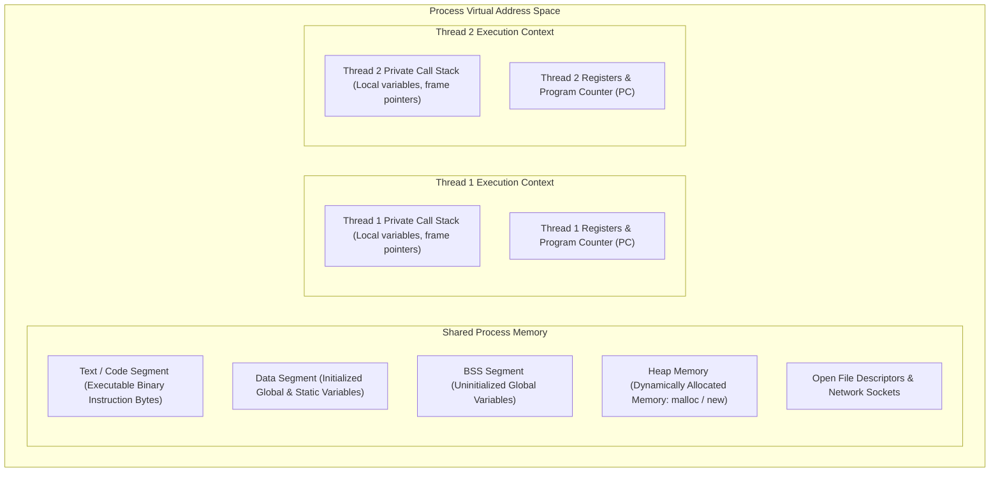
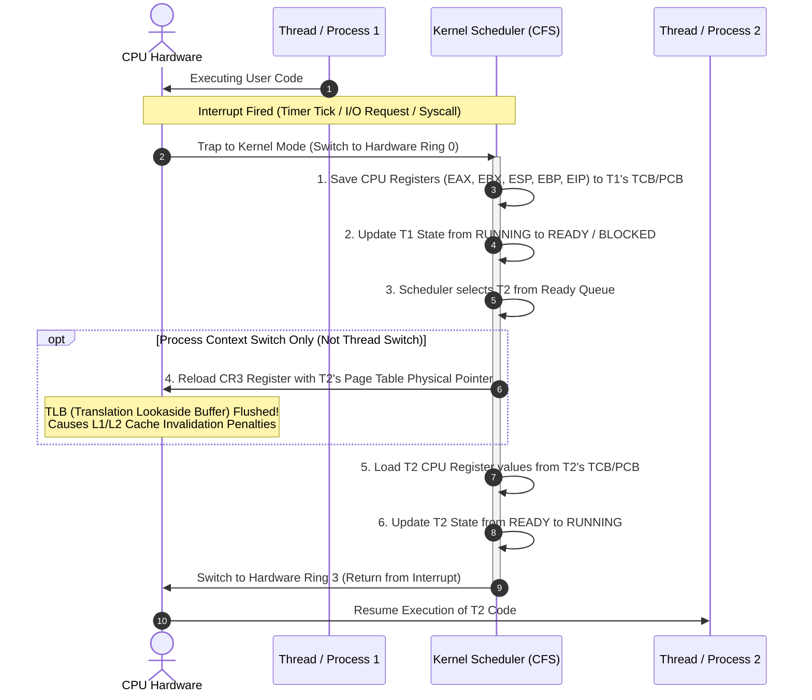
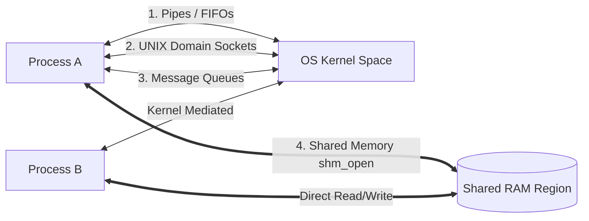
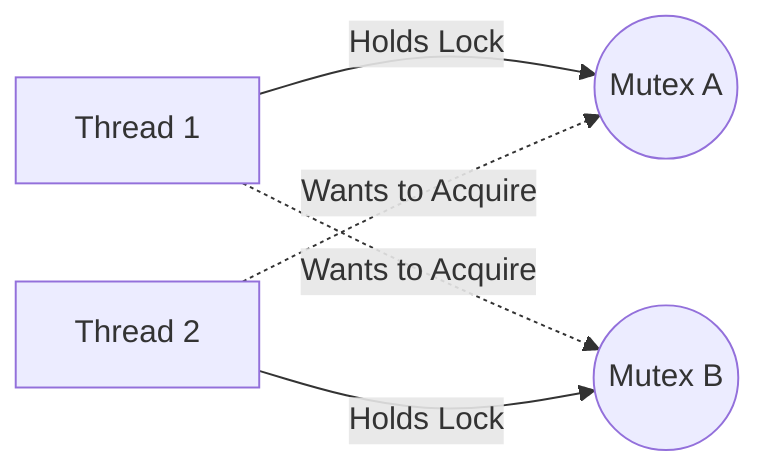

# Thread vs Process: Operating System Architecture & Concurrency Model

## 1. The Problem This Technology Solves

In early computing systems (batch processing era), an Operating System (OS) could execute only **one single program at a time**. The entire Central Processing Unit (CPU), RAM (Random Access Memory), and hardware peripherals were monopolized by that single program until it finished execution or crashed.

### Legacy Limitations & Pain Points

* **CPU Idling during I/O Waits**: When a program requested data from disk or network, the CPU sat completely idle waiting for input/output (I/O) hardware, wasting up to 99% of compute power.
* **No Multi-tasking or Interactivity**: Users could not run a text editor while listening to music or printing a document simultaneously.
* **No Fault Isolation**: If a program encountered a bug (e.g., division by zero or invalid memory access), it crashed the entire machine, requiring a hard hardware reboot.
* **Inefficient Multi-Core Hardware Utilization**: As CPUs evolved from single-core to multi-core architectures, single-threaded single-process applications were physically incapable of executing across multiple CPU cores in parallel.

### Historical Evolution & Concurrency Paradigm Comparison

| Concurrency Paradigm | Execution Model | Memory Isolation | Hardware Utilization | Primary Limitation / Bottleneck |
| :--- | :--- | :--- | :--- | :--- |
| **Batch Processing** | Single execution sequentially. | ❌ None (Single program owns whole machine). | Very Low (< 10%) | Entire system halts during disk/network I/O operations. |
| **Cooperative Multitasking** | Programs voluntarily yield CPU control (`yield`). | ⚠️ Weak / Shared address space. | Medium | A single buggy or rogue application freezing locks the entire OS (e.g., Windows 3.1, Mac OS 9). |
| **Preemptive Multitasking (Processes)** | OS hardware timer forcibly interrupts and switches processes. | ✅ Strict (Isolated Virtual Memory address space). | High | High context-switching overhead and memory footprint per process. |
| **Multi-threading (Threads)** | Light-weight execution paths within the *same* process. | ❌ Shared Process Memory (Private Stack only). | Ultra High (Parallel multi-core execution) | Race conditions, data corruption, deadlocks, and shared state complexity. |
| **Asynchronous Event Loop** | Single-threaded non-blocking event-driven loop (e.g., Node.js). | N/A (Single thread) | High for I/O bound, Low for CPU bound | CPU-heavy computation blocks the entire event loop, freezing all concurrent requests. |

> **Interview one-liner:** Processes and Threads were invented to transition operating systems from wasteful single-task execution to preemptive multi-tasking and parallel multi-core processing, maximizing CPU utilization while balancing memory isolation and execution overhead.

---

## 2. Core Definition & Fundamental Concepts

### What is a Process?
A **Process** is an active instance of a computer program being executed by the Operating System. It is the primary unit of resource allocation in an OS. 

When a program stored on disk (an executable binary file) is launched, the OS creates a Process by:
1. Allocating a private **Virtual Address Space** in RAM.
2. Loading program code and static data into memory.
3. Allocating OS kernel resources (File Descriptors, Network Sockets, Security Credentials).
4. Creating a **Process Control Block (PCB)** to track execution state.

### What is a Thread?
A **Thread** (often called a *Lightweight Process* or LWP) is the smallest sequence of programmed instructions that can be managed and scheduled independently by the OS Kernel Scheduler.

A Thread exists **inside** a Process. Multiple threads belonging to the same parent process share the process's Virtual Address Space (Code, Data, Heap) and open file handles, but each thread possesses its own private execution context:
* **Thread Control Block (TCB)**
* **Program Counter (PC)** (tracking which instruction is currently executing)
* **CPU Registers** (holding current variable values)
* **Private Call Stack** (tracking local function variables, parameter passing, and return addresses)

### Full Form of Key Operating System Acronyms

To ensure absolute clarity across technical discussions and documentation, below are the full expansions for common OS short terms used in this note:

* **PCB**: Process Control Block
* **TCB**: Thread Control Block
* **CPU**: Central Processing Unit
* **RAM**: Random Access Memory
* **MMU**: Memory Management Unit
* **TLB**: Translation Lookaside Buffer
* **IPC**: Inter-Process Communication
* **COW**: Copy-On-Write
* **GIL**: Global Interpreter Lock
* **CFS**: Completely Fair Scheduler (Linux Kernel Scheduler)
* **POSIX**: Portable Operating System Interface
* **ISR**: Interrupt Service Routine

---

### Process vs Thread: Direct Side-by-Side Comparison

| Architectural Trait | Process | Thread |
| :--- | :--- | :--- |
| **Definition** | Autonomous executing program with independent resource ownership. | Lightweight unit of CPU execution within a parent process. |
| **Memory Isolation** | ✅ **Strict Isolation**. Each process has its own Virtual Memory address space. | ❌ **Shared Memory**. Threads share Code, Data, and Heap with sibling threads. |
| **Creation Overhead** | ⚠️ **High**. Allocates new Page Tables, File Descriptor tables, and PCB. | ⚡ **Low**. Shares existing process memory; allocates only Stack and TCB. |
| **Context Switch Overhead** | ⚠️ **Expensive**. Requires CPU register swap, Memory Management Unit (MMU) Page Table pointer switch (CR3 register), and Translation Lookaside Buffer (TLB) flush. | ⚡ **Cheap**. CPU register swap and Stack Pointer update only. MMU Page Tables and TLB remain intact. |
| **Communication (IPC)** | Slow & Complex via **Inter-Process Communication (IPC)** (Pipes, Sockets, Shared Memory primitives). | Ultra-Fast direct memory access (reading/writing shared Heap variables). |
| **Crash Impact / Resilience** | ✅ **High Resilience**. If one process crashes (e.g., Segmentation Fault), other processes continue running unaffected. | ❌ **Low Resilience**. If one thread triggers an unhandled memory fault, it kills the **entire parent process**. |
| **Security Boundary** | High protection enforced at the hardware MMU level. | Minimal internal protection between sibling threads. |

---

### Execution Models: Kernel Threads vs User Threads vs Green Threads

| Model | Managed By | OS Kernel Awareness | Context Switch Speed | Multi-Core Parallelism | Examples |
| :--- | :--- | :--- | :--- | :--- | :--- |
| **Kernel-Level Threads (1:1)** | OS Kernel Scheduler | ✅ Fully Aware | Fast (Kernel Trap required) | ✅ True multi-core execution | Linux `NPTL` (pthreads), Windows Threads, Java Native Threads |
| **User-Level Threads (N:1)** | User-space Runtime Library | ❌ Unaware (Kernel sees 1 Process) | Ultra Fast (No Kernel Syscall) | ❌ Cannot utilize multiple CPU cores | Early Java Green Threads, GNU Portable Threads |
| **Hybrid / Coroutines / Fibers (M:N)** | Language Runtime + OS Kernel | ⚡ Cooperative Multiplexing | Lightning Fast | ✅ True multi-core execution | Go (`goroutines`), Erlang Processes, Kotlin Coroutines, Java Loom |

> **Interview one-liner:** A Process is an isolated container owning private memory and system resources, whereas a Thread is a lightweight unit of CPU execution operating within a process container.

---

## 3. How It Actually Works Under the Hood

### Memory Layout Architecture

Understanding the physical structure of memory inside a Process is crucial for understanding how Threads interact.



---

### Step-by-Step Mechanics of Creation & Lifecycle

#### Process Creation (`fork()` & `execve()`)
1. **System Call (`fork`)**: On POSIX systems (Linux/macOS), a parent process invokes `fork()`. The OS Kernel creates a exact duplicate child process.
2. **Copy-On-Write (COW) Optimization**: To avoid expensive physical copying of gigabytes of RAM, the kernel marks the child's Page Tables as read-only and points them to the parent's physical RAM pages. Pages are physically duplicated **only when either process attempts to write** to memory.
3. **Execution Replacement (`execve`)**: The child process typically calls `execve()`, replacing its memory space with a new binary program from disk.

#### Thread Creation (`pthread_create()` / `clone()`)
1. **System Call (`clone`)**: On Linux, thread creation uses the `clone()` system call with flags `CLONE_VM`, `CLONE_FS`, `CLONE_FILES`, `CLONE_SIGHAND`.
2. **Resource Sharing**: Instead of duplicating page tables, the kernel instructs the new thread structure to point to the exact same Page Table directory and File Descriptor table as the caller.
3. **Stack Allocation**: The kernel or runtime allocates a fresh segment of memory (typically 1MB - 8MB) on the Heap to serve as the new thread's private execution stack.

---

### The Anatomy of a Context Switch

A **Context Switch** is the procedure performed by the OS Kernel Scheduler to suspend execution of one CPU context (Process or Thread) and resume execution of another.



#### Why Process Context Switches Are Expensive:
1. **CPU Register State Saving**: Saving/restoring general-purpose registers, floating-point units, and stack pointers.
2. **Page Directory Pointer Switch (CR3 Register)**: Changing the MMU address space translation tables.
3. **TLB (Translation Lookaside Buffer) Flush**: The hardware cache storing recent Virtual-to-Physical memory mappings is completely invalidated. Subsequent memory accesses suffer severe CPU cache miss penalties until the TLB is repopulated.
4. **L1 / L2 Data Cache Pollution**: Process 2 accesses entirely different memory addresses, causing cold cache line replacements.

> **Interview one-liner:** A process context switch requires flushing the MMU Translation Lookaside Buffer (TLB) and swapping virtual memory page tables, whereas a thread context switch only updates CPU registers and stack pointers within the same memory space.

---

## 4. Core Properties / Defining Characteristics

| Property | Process | Thread | Plain-English Explanation |
| :--- | :--- | :--- | :--- |
| **Address Space** | Private & Isolated | Shared | Processes live in isolated bubbles; threads share the same house (Heap/Globals) but have private bedrooms (Stacks). |
| **Creation Cost** | Heavyweight (~1-10ms) | Lightweight (~10-100µs) | Creating a process requires constructing a full virtual memory hierarchy; thread creation allocates only a stack segment. |
| **Memory Footprint** | Large (Megabytes to Gigabytes) | Small (Kilobytes to Megabytes) | Process base overhead includes memory tables and runtime environment; thread overhead is primarily its stack depth. |
| **Synchronization Need** | Low (Self-contained) | Critical (Mutexes/Locks required) | Threads can write to shared memory concurrently, creating data race bugs unless synchronized. |
| **Communication Speed** | Microseconds (System Call required) | Nanoseconds (Direct Memory Access) | Threads talk by writing to shared variables; processes must invoke kernel IPC channels. |
| **Fault Containment** | High (Process boundaries) | Low (Process wide blast radius) | An invalid pointer access (`NullPointerException` / `SIGSEGV`) in one thread crashes all sibling threads in the process. |

---

## 5. Bare OS Primitives vs. High-Level Language Runtimes

Developers rarely call OS kernel primitives like `clone()` or `pthread_create()` directly. Modern programming languages provide sophisticated runtime abstractions around concurrency.

### Language & Framework Comparison Matrix

| Language / Environment | Concurrency Abstraction | Underlying OS Mapping | Handling of Multi-Core Parallel Execution | Key Gotchas / Architectural Constraints |
| :--- | :--- | :--- | :--- | :--- |
| **C / POSIX C++** | `pthreads` (`pthread_create`) | 1:1 OS Kernel Thread | ✅ True native CPU parallelism | Manual memory management; manual synchronization required. |
| **Node.js (V8)** | `child_process` & `worker_threads` | `child_process` = 1:1 OS Process<br/>`worker_threads` = 1:1 OS Thread (with isolated V8 Isolate) | ✅ `worker_threads` enable parallel CPU computation | Node threads **do not share V8 JS object heap**. Data must be passed via `postMessage()` serialization or `SharedArrayBuffer`. |
| **Python (CPython)** | `threading` & `multiprocessing` | `threading` = 1:1 OS Thread<br/>`multiprocessing` = 1:1 OS Process | ❌ `threading` **cannot execute CPU tasks in parallel** due to GIL.<br/>✅ `multiprocessing` achieves parallel execution. | Global Interpreter Lock (GIL) enforces single-threaded JS/Python execution per interpreter process for CPU tasks. |
| **Java (JVM)** | `java.lang.Thread` & Virtual Threads (Loom) | Native = 1:1 OS Thread<br/>Virtual Threads = M:N Multiplexed | ✅ True parallel execution across all CPU cores | Traditional JVM threads are memory heavy (~1MB stack). Java 21+ Virtual Threads enable millions of concurrent I/O tasks. |
| **Go (Golang)** | `goroutines` (`go func()`) | M:N Scheduler (Go Runtime GMP Model) | ✅ Multiplexes thousands of Goroutines over a small pool of OS threads | Stack grows dynamically from 2KB. Channel communication avoids shared-memory locking pitfalls. |

---

### Code Examples across Environments

#### 1. Node.js Worker Threads vs Child Processes

```javascript
// Node.js: worker_threads (Offloading CPU heavy math without blocking Event Loop)
const { Worker, isMainThread, parentPort, workerData } = require('worker_threads');

if (isMainThread) {
  // Main Thread: Spawns a worker thread sharing memory buffer
  const sharedBuffer = new SharedArrayBuffer(4); // 4 bytes of shared memory
  const worker = new Worker(__filename, { workerData: { buffer: sharedBuffer } });
  
  worker.on('message', (msg) => console.log('Result from Thread:', msg));
} else {
  // Worker Thread Context
  const typedArray = new Int32Array(workerData.buffer);
  Atomics.add(typedArray, 0, 42); // Thread-safe atomic addition
  parentPort.postMessage('Calculation Complete');
}
```

#### 2. Python Multiprocessing vs Threading (Bypassing GIL)

```python
import multiprocessing
import threading

def cpu_heavy_task(n):
    return sum(i * i for i in range(n))

# Python Threading (Limited by GIL - Good for I/O, Useless for CPU parallelization)
t = threading.Thread(target=cpu_heavy_task, args=(10000000,))
t.start()

# Python Multiprocessing (Spawns separate OS Processes - Bypasses GIL for true CPU parallelism)
p = multiprocessing.Process(target=cpu_heavy_task, args=(10000000,))
p.start()
```

> **Interview one-liner:** High-level runtimes abstract OS threads and processes; for instance, Node.js uses isolated V8 threads, Python relies on multiprocessing to bypass the GIL, and Go uses M:N goroutines to achieve ultra-lightweight concurrency.

---

## 6. Core Components — Practical Breakdown

### 1. Process Control Block (PCB) & Thread Control Block (TCB)
The OS Kernel maintains structured metadata records in kernel space for tracking active tasks.

* **PCB Contents**: Process ID (PID), Process State, Pointer to Page Directory (CR3), Open File Descriptors table, User/Group Permissions, Signal Handlers, CPU Scheduling Info, Memory Limits.
* **TCB Contents**: Thread ID (TID), Thread State, Stack Pointer (ESP/RSP), Program Counter (EIP/RIP), Copy of General Purpose CPU Registers, Pointer to parent PCB.

---

### 2. Inter-Process Communication (IPC) Mechanisms

Because processes reside in isolated virtual memory spaces, they cannot directly read or write each other's memory. The OS provides explicit **Inter-Process Communication (IPC)** primitives:



| IPC Mechanism | Speed / Overhead | Communication Scope | Best Use Case |
| :--- | :--- | :--- | :--- |
| **Anonymous Pipe (`\|`)** | Fast | Parent-Child processes on same host | Shell command piping (`ls \| grep`). |
| **Named Pipe (FIFO)** | Fast | Unrelated processes on same host | Local stream communication. |
| **Shared Memory (`shm_open`)** | ⚡ **Fastest** (Zero-copy) | Processes on same host | High-throughput data streaming (e.g., video processing, high-frequency trading). Requires Mutexes. |
| **Unix Domain Sockets** | Medium | Processes on same host | High-performance IPC (e.g., NGINX to Node.js / Docker daemon communication). |
| **Network Sockets (TCP/IP)** | Slowest | Cross-machine or local loopback | Distributed microservices, web servers. |
| **Signals (`SIGKILL`, `SIGTERM`)** | Asynchronous / Instant | Processes on same host | Notification and process lifecycle control. |

---

### 3. Thread Synchronization Primitives

Because threads share the same Heap memory space, concurrent uncontrolled writes cause **Data Races** and unpredictable corruptions. OS runtimes provide locking primitives:

* **Mutex (Mutual Exclusion Lock)**: A binary lock. Only *one single thread* can hold the lock at any time. Other threads attempting to acquire the lock are suspended until it is unlocked.
* **Counting Semaphore**: A concurrency counter allowing up to $N$ threads to access a resource concurrently (e.g., limiting database connection pool access to 10 connections).
* **Spinlock**: A lock where waiting threads do not sleep (no context switch); instead, they loop continuously in a CPU `while(locked)` spin-wait. Ideal for ultra-short lock durations.
* **Read-Write Lock (`rwlock`)**: Allows multiple concurrent readers **OR** one exclusive writer, maximizing read throughput in read-heavy applications.
* **Condition Variable**: Signals threads to sleep until a specific application condition state becomes true (e.g., Producer-Consumer queues).

---

## 7. Alternatives & Concurrency Decision Framework

### Concurrency Architecture Comparison Table

| Architecture Pattern | Scalability | CPU-Bound Performance | I/O-Bound Performance | Implementation Complexity | Primary Real-World Example |
| :--- | :--- | :--- | :--- | :--- | :--- |
| **Multi-Process Architecture** | High | Excellent (Utilizes all cores) | Moderate | Medium (Requires IPC) | Chrome Browser Tabs, PostgreSQL Database, NGINX master/worker |
| **Multi-Threaded Architecture** | High | Excellent (Utilizes all cores) | High | High (Requires synchronization locks) | Java Spring Boot, C++ Game Engines, Redis 6+ I/O threads |
| **Single-Threaded Event Loop** | Extreme for I/O | Poor (Blocks loop) | Excellent | Low | Node.js, Redis (Core engine), NGINX worker event loop |
| **Green Threads / Coroutines** | Extreme (Millions) | Excellent | Excellent | Low / Moderate | Go (`goroutines`), Kotlin Coroutines, Java 21 Virtual Threads |

### How to Reason Out Loud in an Interview

```
                      Is your task CPU-bound or I/O-bound?
                                      │
            ┌─────────────────────────┴─────────────────────────┐
       CPU-Bound                                            I/O-Bound
            │                                                   │
   Does language have GIL?                             Are connections massive?
     (e.g., Python, Ruby)                             (100k+ concurrent sockets)
      ┌─────┴─────┐                                       ┌─────┴─────┐
     YES          NO                                     YES          NO
      │            │                                      │            │
  Multi-        Multi-                                Event Loop /   Multi-
  Process       Threading                             Coroutines    Threading
(multiprocess) (pthreads)                              (Node/Go)    (Java/C#)
```

> **Interview one-liner:** For CPU-heavy tasks use Multi-processing or Native Multi-threading across cores; for I/O-bound massive concurrency choose Event Loops or Coroutines to avoid thread stack overhead.

---

## 8. Comprehensive Pros & Cons

### Multi-Process Model

#### Pros
* ✅ **Strict Fault Isolation**: A crash, segfault, or memory leak in one process leaves all other processes running safely.
* ✅ **Security Sandboxing**: Hardware MMU isolation prevents malicious code in one process from reading sensitive memory in another (e.g., Chrome tab isolation).
* ✅ **Bypasses Single-Threaded Interpreter Locks**: Completely avoids language GIL limits (Python, Ruby).

#### Cons
* ❌ **Heavy RAM Consumption**: Duplicate loading of runtime overhead and memory structures per process.
* ❌ **Slow Process Creation & Context Switching**: High CPU cost for spawning processes and switching page directories.
* ❌ **Complex Data Sharing**: Requires OS-mediated IPC channels.

---

### Multi-Threaded Model

#### Pros
* ✅ **Lightweight Footprint**: Spawns fast and consumes minimal memory per thread.
* ✅ **Zero-Copy Memory Sharing**: Threads instantly share data through heap memory variables without IPC overhead.
* ✅ **Fast Context Switching**: Switches execution contexts in nanoseconds without invalidating TLB caches.

#### Cons
* ❌ **No Fault Tolerance**: An unhandled exception or memory error in one thread crashes the entire application process.
* ❌ **Concurrency Bugs**: Extremely susceptible to Race Conditions, Deadlocks, Livelocks, and Data Corruption.
* ❌ **Complex Synchronization Overhead**: Over-locking introduces lock contention, reducing parallel throughput.

---

## 9. Critical Production Gotchas & Scaling Failures

### Gotcha 1: Deadlocks (The Four Coffman Conditions)

A **Deadlock** occurs when two or more threads are permanently blocked, each waiting for a lock held by the other.



#### The 4 Coffman Conditions (All 4 must hold for a deadlock to occur):
1. **Mutual Exclusion**: Resources cannot be shared concurrently.
2. **Hold and Wait**: Thread holds a resource while requesting another.
3. **No Preemption**: Locks cannot be forcibly confiscated from threads.
4. **Circular Wait**: Thread A waits for Thread B, which waits for Thread A.

#### Production Solution:
* Enforce **Strict Global Lock Acquisition Ordering** (Always acquire Mutex A before Mutex B across all codebase paths).
* Use **Timed Lock Acquisition** (`pthread_mutex_timedlock` / `tryLock()` with timeouts).

---

### Gotcha 2: Context Switch Thrashing & Over-threading

**Symptom**: Application throughput drops to near zero despite 100% CPU utilization.

**Root Cause**: Spawning 10,000 native OS threads on an 8-core CPU. The OS spends 90% of its CPU cycles saving/restoring registers and flushing TLB page tables (Context Switching), leaving only 10% for actual application code execution.

#### Production Solution (Thread Pool Sizing Formula):
Never spawn unlimited threads. Use bounded **Thread Pools**.

$$\text{Optimal Thread Count} = N_{\text{CPU Cores}} \times U_{\text{CPU Target}} \times \left(1 + \frac{W}{C}\right)$$

* Where $W$ = Waiting time (I/O block time)
* Where $C$ = Computing time (CPU execution time)

---

### Gotcha 3: Race Conditions & Data Races

**Symptom**: Intermittent, hard-to-reproduce data corruption or incorrect counter increments under heavy load.

#### Production Solution:
* Use **Atomic Primitives** (`std::atomic`, `java.util.concurrent.atomic`, `Atomics` in JS) which utilize hardware CPU instructions like `CMPXCHG` (Compare-And-Swap).
* Validate code using **ThreadSanitizer (TSan)** during testing (`-fsanitize=thread`).

---

## 10. Quick-Fire Interview Questions & Model Answers

### Q1: What is the fundamental difference between a Process and a Thread?
**Model Answer:** A Process is an autonomous execution environment with its own isolated virtual address space, file descriptors, and kernel resources. A Thread is a lightweight unit of execution within a parent process that shares memory (Code, Data, Heap) with sibling threads but maintains its own stack, CPU registers, and program counter.

### Q2: Why is a Process context switch more expensive than a Thread context switch?
**Model Answer:** A Process context switch requires changing virtual memory address spaces by updating the CPU's Memory Management Unit (MMU) page directory pointer (CR3 register), which flushes the Translation Lookaside Buffer (TLB) cache and causes cold CPU cache line invalidations. Thread context switches stay within the same address space, requiring only saving and restoring CPU registers and stack pointers.

### Q3: What is Copy-On-Write (COW) during process creation?
**Model Answer:** Copy-On-Write is an OS memory management optimization used during `fork()`. Instead of immediately copying the parent process's physical memory into the child, the kernel marks shared memory pages as read-only. Physical memory allocation and copying are deferred until either the parent or child attempts to write to a page.

### Q4: How do threads communicate compared to processes?
**Model Answer:** Threads communicate almost instantaneously by reading and writing shared variables in their common Heap address space, requiring synchronization locks (mutexes) to prevent data races. Processes cannot access each other's memory directly and must communicate through OS-mediated Inter-Process Communication (IPC) mechanisms like Shared Memory, Unix Domain Sockets, Pipes, or Network Sockets.

### Q5: What is the Python Global Interpreter Lock (GIL) and how does it affect multi-threading?
**Model Answer:** The GIL is a mutual exclusion lock in CPython that prevents multiple native threads from executing Python bytecode simultaneously. While Python threads work well for offloading blocking I/O operations, CPU-bound tasks must use the `multiprocessing` module to spawn separate OS processes with independent GILs to utilize multiple CPU cores.

### Q6: What are the four Coffman conditions required for a Deadlock?
**Model Answer:** The four necessary conditions for a deadlock are: Mutual Exclusion (exclusive resource access), Hold and Wait (holding a lock while requesting another), No Preemption (locks cannot be forcibly revoked), and Circular Wait (a closed chain of threads waiting for locks held by each other).

### Q7: What is the difference between a Mutex and a Semaphore?
**Model Answer:** A Mutex is a locking mechanism intended for mutual exclusion where only the thread that locked the mutex can unlock it. A Semaphore is a signaling mechanism using a counter that allows up to $N$ threads concurrent access to a resource, and can be signaled or incremented by any thread.

### Q8: What are Green Threads / Coroutines and how do they differ from OS Threads?
**Model Answer:** Green threads (like Go's goroutines) are user-space threads managed entirely by a language runtime rather than the OS kernel. They multiplex $M$ user-space threads over $N$ kernel threads, featuring dynamic sub-kilobyte stacks and lightning-fast context switches without kernel syscall traps.

### Q9: What happens when a thread encounters a Segmentation Fault?
**Model Answer:** When a thread attempts an invalid memory access, the CPU triggers a hardware trap that the OS delivers as a `SIGSEGV` signal to the process. Because memory signals apply to the entire virtual address space, unless caught by a custom signal handler, the signal terminates the entire parent process, crashing all sibling threads.

### Q10: How does Node.js achieve concurrency despite being single-threaded?
**Model Answer:** Node.js runs application JavaScript on a single-threaded event loop. For non-blocking I/O (network requests), it offloads operations to the underlying OS kernel using epoll/kqueue. For blocking I/O or CPU tasks, it delegates work to a background libuv worker thread pool (`worker_threads`), executing callbacks on the main event loop upon completion.

---

## 11. One-Paragraph Master Summary

> **Master Summary:** A **Process** is an independent operating system container allocated isolated virtual memory (Code, Data, Heap), file handles, and a Process Control Block (PCB), ensuring strict fault isolation and security at the cost of higher creation and context-switching overhead (due to Memory Management Unit page table updates and Translation Lookaside Buffer flushes). A **Thread** is a lightweight execution unit inside a process that shares the parent’s address space and heap while maintaining a private stack, registers, and Thread Control Block (TCB), enabling ultra-fast execution and zero-copy memory communication at the risk of race conditions, deadlocks, and process-wide crashes. Modern systems balance these tradeoffs by using multi-processing for isolated CPU-bound tasks (or bypassing interpreter GIL limits), multi-threading or coroutines (Go goroutines, Java Loom) for high-performance concurrent processing, and single-threaded event loops for non-blocking I/O workloads.

---
