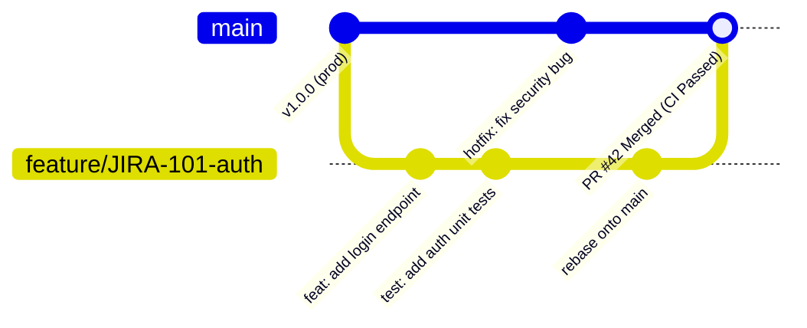

# 🔀 Industry Git Workflow: Feature Branches, Pull Requests & CI/CD Pipelines

> **Target Audience:** Interns & Junior Engineers transitioning from personal repos to team engineering  
> **Target Skill:** Master production Git workflows, branch protection rules, Conventional Commits, PR reviews, and CI/CD automated test pipelines  
> **Estimated Reading Time:** 12 mins  

---

## 💡 1. Mental Model & The Team Production Lifecycle

In university or personal side-projects, developers often push code directly to `main` (`git add . && git commit && git push`).

**In a real-world software engineering company, pushing directly to `main` is strictly forbidden.** 

The `main` branch represents **live production code** serving real customers. Every code change must be isolated, automated-tested, peer-reviewed, and verified before merging.

```text
Personal Project:    [Developer] ───────────────────────────────► PUSH DIRECTLY TO MAIN (Dangerous!)

Industry Workflow:  [Developer] ──► Feature Branch ──► Pull Request ──► CI/CD Test Pipeline ──► Peer Review ──► Merge to Main
```

---

## 🏗️ 2. Step-by-Step Production Branch Lifecycle



### The 5 Standard Phases of an Industry Feature:
1. **Branch Creation:** Create a clean branch from `origin/main` following team naming conventions (e.g. `feature/ticket-123-description`).
2. **Atomic Commits:** Make clean, single-purpose commits using Conventional Commit syntax.
3. **Rebase & Sync:** Fetch latest changes from `main` and rebase your branch so history stays linear.
4. **Pull Request (PR) & CI Automation:** Open a PR against `main`. Automated pipelines trigger to run linter, unit tests, and security scanners.
5. **Peer Review & Merge:** Address review feedback, get 1-2 code owner approvals, and squash-merge into `main`.

---

## 💻 3. Step-by-Step Command Cheat Sheet

### Step 1: Start with a Fresh Branch
Always ensure your local `main` is up to date before branching off:

```bash
# Switch to main and pull latest remote changes
git checkout main
git pull origin main

# Create and switch to your feature branch
git checkout -b feature/AUTH-102-jwt-middleware
```

### Step 2: Write Code & Make Conventional Commits
Avoid vague commit messages like `fixed stuff` or `WIP`. Use **Conventional Commits**:

* `feat: add JWT token validation middleware`
* `fix: handle expired token 401 error gracefully`
* `test: add unit test suite for token parser`
* `docs: update API endpoints in README`

```bash
git add src/middleware/auth.ts
git commit -m "feat: add JWT token validation middleware"
```

### Step 3: Rebase onto Main Before Opening PR
If teammates merged code into `main` while you were working, sync your branch using `git rebase` instead of `git merge`:

```bash
# Fetch latest remote changes without modifying your working files
git fetch origin main

# Rebase your commits on top of the latest main
git rebase origin/main
```

> **Why Rebase over Merge?** `git rebase` avoids ugly "Merge branch 'main' into feature" clutter commits and maintains a clean, linear git history.

### Step 4: Push to Remote & Create Pull Request

```bash
# Push branch to remote server
git push -u origin feature/AUTH-102-jwt-middleware
```

Go to GitHub/GitLab, click **New Pull Request**, fill out the PR Template, and tag team members for review.

---

## 🤖 4. How CI/CD Pipelines Guard Production

When you open or update a PR, an automated **CI (Continuous Integration) Pipeline** triggers in the cloud (e.g. GitHub Actions, GitLab CI, CircleCI).

Here is what a production GitHub Actions workflow file (`.github/workflows/pr-checks.yml`) looks like:

```yaml
name: Pull Request CI Verification

on:
  pull_request:
    branches: [ main ]

jobs:
  verify-code:
    runs-on: ubuntu-latest
    steps:
      - name: Checkout Code
        uses: actions/checkout@v4

      - name: Setup Node.js Environment
        uses: actions/setup-node@v4
        with:
          node-version: '20'
          cache: 'npm'

      - name: 1. Install Dependencies
        run: npm ci

      - name: 2. Run Linter (Code Style Check)
        run: npm run lint

      - name: 3. Run Unit Tests & Coverage Check
        run: npm run test:unit

      - name: 4. Build Production Bundle Check
        run: npm run build
```

### 🛑 Why CI Checks Block Merging
If any step fails (e.g., a lint error or failing unit test):
* The PR receives a ❌ **Check Failed** badge.
* The **Merge Button is automatically disabled**.
* You must fix the error locally, commit, and push again. The pipeline automatically re-runs.

---

## 🚨 5. Real-World Production Failure Case Study

### The Disaster: The `--force` Push Nightmare
* **Symptom:** A new software engineering intern modified local files on `main`, ran into a conflict, and ran `git push --force origin main`. This wiped out 3 days of work committed by 4 senior engineers on `main`.
* **Root Cause:** 
  1. The intern did not know that `--force` overwrites the remote repository unconditionally with their local copy.
  2. The GitHub repository lacked **Branch Protection Rules**.

* **The Production Fix & Prevention:**
  1. **Enable Branch Protection Rules:** In GitHub Settings ➔ Branches ➔ Protect `main`:
     * ✅ Require a pull request before merging (Require 1+ approvals).
     * ✅ Require status checks (CI tests) to pass before merging.
     * ✅ **Include Administrators & Block Force Pushes**.
  2. **Safe Force Pushing:** If you must update a rebased feature branch, **NEVER** use `--force`. Always use `--force-with-lease`:
     ```bash
     git push --force-with-lease origin feature/AUTH-102-jwt-middleware
     ```
     `--force-with-lease` checks if anyone else pushed to your branch in the background and aborts if it detects remote changes!

---

## 🧪 6. Applied Micro-Challenge

> **Scenario:** You submit a PR for `feature/user-profile`. A reviewer says: *"Looks great! But main has updated. Please rebase on main and squash your 8 small commits into 1 clean commit."*
> 
> **Question:** What sequence of Git commands do you execute to squash your 8 commits and update the PR safely?

<details>
<summary><b>Reveal Solution & Explanation</b></summary>

### Step-by-Step Command Solution:

1. **Fetch & Rebase Interactively:**
   ```bash
   git fetch origin main
   git rebase -i origin/main
   ```

2. **Squash Commits in Interactive Text Editor:**
   An editor will open listing your 8 commits:
   ```text
   pick a1b2c3d feat: initial setup
   squash e4f5g6h fix typo
   squash i7j8k9l work on layout
   squash m1n2o3p fix lint errors
   ...
   ```
   Keep `pick` on the first commit, change `pick` to `squash` (or `s`) on the remaining 7 commits, save and close.

3. **Write One Clean Commit Message:**
   `feat: add user profile page and settings layout`

4. **Safely Push to Remote PR:**
   ```bash
   git push --force-with-lease origin feature/user-profile
   ```
   The PR on GitHub will automatically update to show 1 single clean commit and run CI checks!
</details>
