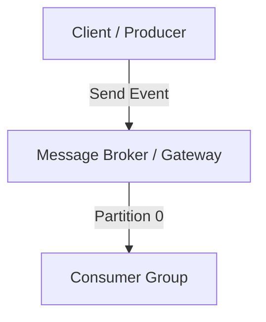

# 📘 [Topic Title]

> **Prerequisites:** [List prerequisite concepts]  
> **Target Skill:** [Real-world engineering outcome]  
> **Estimated Reading Time:** [X mins]  

---

## 💡 1. Mental Model & Core Concept

Explain the concept using a high-level real-world analogy. Avoid purely academic definitions—focus on *why* production systems need this pattern.

---

## 🏗️ 2. Architectural Blueprint & Data Flow



Explain step-by-step how data flows through the architecture.

---

## 💻 3. Production Code Implementation & Patterns

Provide clean, production-grade code snippets with inline comments explaining critical lines.

```typescript
// Production implementation snippet
```

### ⚠️ Production Trade-offs & Gotchas
* **Performance:** [Trade-off 1]
* **Failure Mode:** [Trade-off 2]
* **Resource Impact:** [Trade-off 3]

---

## 🚨 4. Real-World Production Failure Case Study

Describe a realistic production outage or performance bottleneck caused by misconfiguring or misunderstanding this concept, along with the exact fix.

* **Symptom:** [What went wrong in production]
* **Root Cause:** [Technical explanation]
* **Resolution:** [Code / Config fix]

---

## 🧪 5. Applied Micro-Challenge

Present a short scenario-based problem for the reader to test their understanding.

> **Scenario:** [Describe a practical engineering problem]  
> **Question:** How would you resolve this issue?  
> <details><summary><b>Reveal Solution & Explanation</b></summary>
> 
> Detailed explanation of the solution.
> </details>
